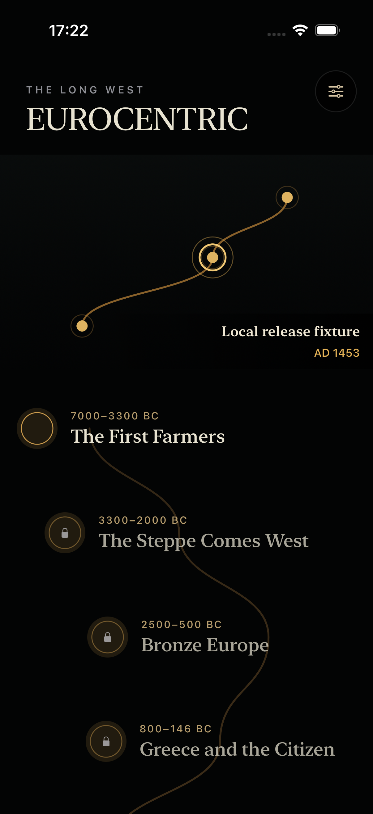
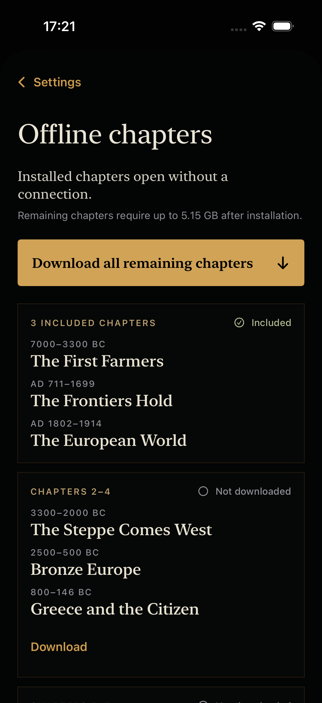
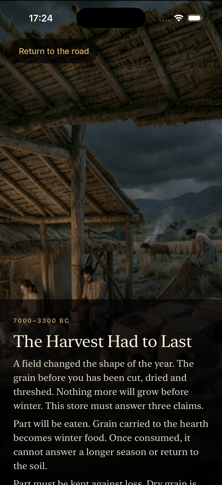

# Validering mot målbildet — 26. juli 2026

## Konklusjon

Prosjektet har en langt fremskreden native grunnmur og en representativ
Chapter 1-rute som kan bygges for ARM64 iPhone. Det ferdige verket er fortsatt
tidlig i produksjonen. Et rimelig samlet anslag er `15–20 %` av veien til
App Store-målbildet.

| Delmål | Modenhet nå | Grunnlag |
| --- | ---: | --- |
| Redaksjonell og kausal blueprint | 100 % | 24 godkjente kontrakter, 55 buer, 99 prinsipale interaksjoner og 48 verdensspor. |
| Native motor og arkitektur | ca. 80 % | Skall, fem interaksjonsgrammatikker, offlineautoritet, lagring, lydtransport, tilgjengelighet, pakkeintegritet og Apple-adaptere finnes lokalt. |
| Chapter 1 teknisk live-testløype | ca. 85–90 % | Release-optimalisert ARM64-app med reell Chapter 1-lyd bygger og åpner. To cursor-feil gjenstår etter at lifecycle-restore passerte fokusert `2/2`; full `46/46`, fysisk signering og måling gjenstår. |
| Chapter 1 ferdig opplevelse | ca. 20–30 % | Struktur og runtime finnes; produksjonsbilder, narrasjon, godkjenninger og fysisk bevis mangler. |
| Ferdige shippingkapitler | 0 av 24 | Ingen komplett produksjonsscene, shippinggodkjent assetpakke eller produksjonspakke finnes. |
| Fysisk og live Apple-bevis | 0 % | Ingen fullført iPhone-, StoreKit-, hosted-pack-, CloudKit- eller APNs-runde. |

Prosentene uttrykker modenhet. De er ikke opptelte arbeidstimer og bør ikke
summeres.

## Fersk verifikasjon

| Kontroll | Resultat |
| --- | --- |
| Swift-pakketester | PASS `806/806` |
| Native tooling | PASS `235/235` |
| Native script-tester | PASS `83/83` |
| Representativ fixture | PASS `2/2`, byte-identisk reproduksjon |
| Harvest underlay-verktøy | PASS v1 `10/10`, v2 `6/6`; kandidater er likevel visuelt avvist |
| Thread Sanitizer | PASS `194/194`, 0 funn, simulator-only |
| A Continent Remade signert runtime | PASS `1/1`; tre stadier, touch, VoiceOver, restore og Reduce Motion |
| Three Records UI | PASS `1/1`; ren installasjon åpner korrekt beat uten integritetsfeil |
| Integrert Xcode UI | Siste fullkjøring FAIL `42/46`; lifecycle passerer senere fokusert `2/2`, mens to cursor-deadlinefeil fortsatt reproduseres. Full `46/46` er ikke kjørt på nytt. |
| ARM64 live-testbygg | PASS, `155 677 766` byte, 266 filer og 93 M4A-filer |
| Shipping-lik ARM64 Release | PASS, `17 383 246` byte, 33 filer, 0 fixture-M4A og ingen coverage-instrumentering |
| Release-grense | Ordinær Release PASS; live-testbygget avvises korrekt som `NON_SHIPPING` |
| Fysisk iPhone | OPEN |

## Det som er reelt oppnådd

1. Den redaksjonelle ryggraden er låst og maskinelt beskyttet.
2. Offlineinnhold, eksakt state, fem interaksjonsgrammatikker, lydtransport,
   tilgjengelighetsruter og pakkeintegritet er implementert, ikke bare
   spesifisert.
3. Produktskallet følger launchbeslutningene: én levende verden, tre inkluderte
   kapitler, ett permanent kjøp og tydelig offlinehåndtering.
4. Chapter 1 har alle 17 beats, seks principal-interaksjoner og seks reelle
   responsive lydprogrammer i den signerte testfixturen.
5. Chapter 1-lyden er redusert fra `750 820 004` byte PCM til `85 479 069`
   byte M4A uten å endre det beregnede dekodede arbeidssettet.
6. Vanlig Release holdes fysisk adskilt fra fixture, utviklingstillit,
   produksjonspush, CloudKit og test-appgruppen.

## Produktflyten

### Den levende verden

Ruten og progresjonsmodellen er riktig native produktskall. Grafikken i denne
visningen er fortsatt teknisk materiale, ikke den ferdige kumulative verdenen.

### Offlinekapitler

De tre inkluderte kapitlene, `Download all`, lagringsrammen og pakkestatusene
er implementert. Apple-hostede produksjonspakker finnes ikke ennå.

### Harvest-retningen

Scenen beviser Metal-ruten, typografien og mørkeidentiteten. Den er fortsatt
en forbudt utviklingsfixture. To nye source-only-underlag bestod numeriske
porter 26. juli, men ble avvist i visuell gjennomgang på grunn av tydelige
rekonstruksjonsflekker. De er ikke integrert.

## Størrelse og iPhone-egnethet

Den representative Chapter 1-live-appen er 155,7 MB som usignert app-tre.
Dette siste bevarte `iphoneos`-bygget er eldre enn de siste endringene i
`JourneyModel`, `ProductionChapterRoute` og cursor-pumpen, og må derfor bygges
på nytt før fysisk evidens bindes.
Dette er ikke stort nok til å forklare løpende batteritap. Appens budsjett er
100 MB for skall/motor, 750 MB for de tre gratiskapitlene og 6 GB dersom
brukeren velger å laste ned alle 24 kapitlene.

Det som påvirker batteriet under bruk er:

- Metal-arbeid og faktisk frame pacing;
- samtidig lyddekoding og antall aktive lydgrener;
- minnepress og eventuell rekomprimering;
- den 125 ms-bundne crash-cursorens filbarrierer.

Metal-visningen er pauset i statiske scener og kjører i 60 fps bare i den
`220` millisekunder lange snap-back-responsen. Teksturresidens begrenses til
aktiv komposisjon, og appen laster ett lydprogram om gangen. Live-fixturen
inneholder nå 137 PNG-filer på `50 462 685` byte; fem Harvest-teksturer er
`1290 × 2796`. Three Records er statisk beregnet til 97,92 MB dekodet lyd i
steady state og 115,20 MB under overgang. Crash-cursoren kan fortsatt utløse
14 400 `fsync` på 30 minutter. Den siste kostnaden kan bare avgjøres med den
fysiske batteriprotokollen.

## Avgørende gap

1. `0/24` kapitler har bestått komplett produksjons- og shippingport.
2. Chapter 1 mangler alle 778 produksjonsassetleveranser i shippingtreet.
3. Fortellerstemmen og narrasjonsmasteren er ikke godkjent. Live-fixturen har
   dessuten 0 narrasjonshendelser og appen mangler narrasjonskontroller,
   timelinebinding og gjensidig utestenging mot responsiv lyd.
4. Fire private editoravgjørelser står åpne i Chapter 1.
5. Den integrerte UI-porten er fortsatt rød. Under rask Trace-input kan den
   MainActor-bundne cursor-writeren bomme på 250 ms-fristen. De to tidligere
   lifecycle-feilene passerer fokusert, men full `46/46` må kjøres på nytt.
6. Ingen fysisk iPhone-måling finnes for minne, frame pacing, termikk,
   batteri, hard kill, VoiceOver eller komplett offlinegjennomgang.
7. Ekte StoreKit-produkt, hosted packs, CloudKit-container og APNs er ikke
   prøvd.

## Neste milepæl

Lukk først de fire integrerte UI-feilene og krev `46/46`. Koble deretter til og
klargjør `Basta 16`, signer den isolerte live-testappen og kjør tre parede
30-minutters Chapter 1-/referanserunder. Porten krever under 500
MiB vedvarende fysisk footprint, termisk tilstand `nominal` eller `fair`,
høyst 8 prosentpoeng absolutt batterifall og høyst 3 prosentpoeng over den
statiske referansen.

Parallelt kan produksjonsbilder fortsette. Longhouse A5/A6 er avvist ved 390
punkter og A4 forblir komposisjonsbase. Narrasjon kan først fortsette etter den
låste V12-redaktørbeslutningen; avviste Harvest- og Longhouse-bilder skal ikke
promotere seg gjennom tekniske kvitteringer.

## Evidensgrense

Valideringen bygger på dagens repository, ferske lokale tester, ARM64-bygg og
simulator. Statusen er `Needs revision` for beslutningen «iPhone-klar»: den
integrerte UI-porten er rød, og fysisk energibevis mangler. Valideringen hevder
ikke fysisk iPhone-pass, kunstnerisk godkjenning, shippingautoritet eller live
Apple-tjenestebevis.
