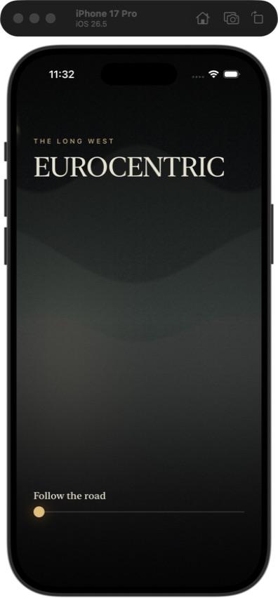
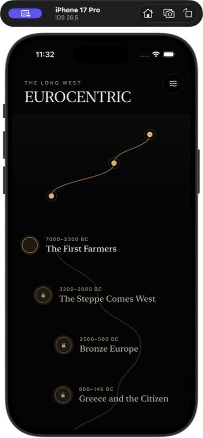
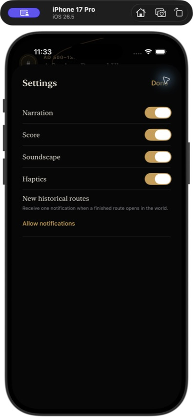
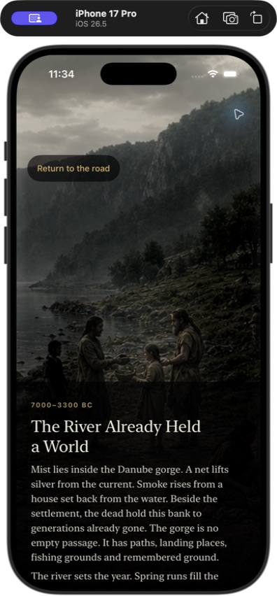
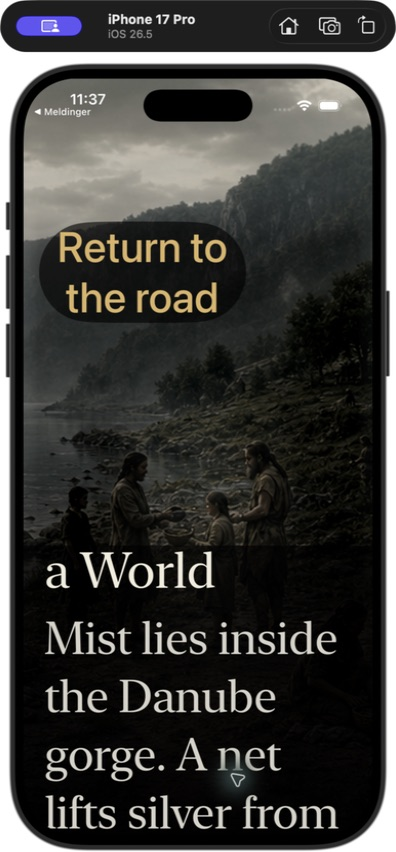
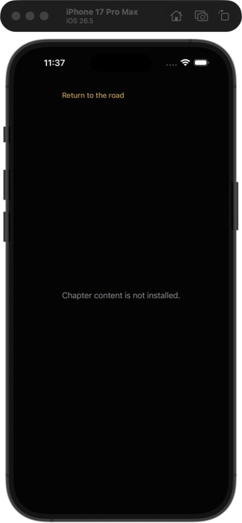
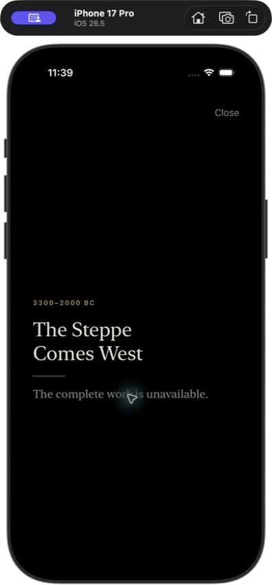

# Full usability- og UX-gjennomgang av den native iPhone-appen

Dato: 28. juli 2026  
Omfang: nåværende appskall og signert `NON_SHIPPING_LIVE_TEST`-kapittel på iPhone i portrett  
Testflater: iPhone 17 Pro, iPhone 17 Pro Max, Accessibility XXXL, kode- og testgjennomgang

## Konklusjon

Appen har en tydelig og særpreget kjerne. Åpningen er rask, verdenen er visuelt lesbar, og kapitlet føles som en historisk scene fremfor en artikkel i en app. Den nåværende brukerreisen er likevel ikke klar for release.

Tre forhold må løses før en ny brukertest gir mening:

1. Store iPhone-modeller kan få den uriktige feilen «Chapter content is not installed» selv om pakken er installert.
2. Lydkontrollen forsvinner etter avspilling. Brukeren står uten pause eller mute, og innstillingen «Narration: On» motsies av en ny knapp som heter «Hear the scene» i hvert beat.
3. Kapitlets tekst, lydvalg, handlingsinstruksjon og «Continue» ligger i samme lave ScrollView. Den viktigste handlingen er derfor ofte under folden, uten synlig kapittelposisjon eller vei tilbake til tidligere scener.

Jeg er enig i å fjerne «Hear the scene». Lyd bør starte når brukeren bevisst åpner et kapittel og den lagrede lydinnstillingen er på. Dette er ikke lyd på kald appstart: etter avbrudd, kald gjenoppretting eller hodetelefonbytte skal avspillingen stå pauset til brukeren velger «Resume sound».

## Anbefalt modell for lyd

Den minste forståelige modellen er:

- Et trykk på et kapittel starter scenen. Hvis `Sound` er på, starter det forfattede lydforløpet når scenen er klar.
- En fast 44 × 44-punkts lydknapp ligger øverst til høyre gjennom hele kapitlet. Den har tilstandene `Mute sound`, `Unmute sound` og `Resume sound`.
- Mute pauser fortellerstemmen på eksakt posisjon og fader resten av miksen. Unmute fortsetter der brukeren var.
- Lyd fortsetter automatisk mellom beats i samme kapittel. Brukeren skal ikke gi nytt samtykke til hver scene.
- Kald åpning av appen, retur etter avbrudd og endring av lydrute starter ikke lyd av seg selv. Den faste kontrollen viser `Resume sound`.
- Systemets stillemodus og annen pågående lyd skal respekteres. Dagens `.playback`-sesjon kan ellers spille gjennom stillemodus og overta annen lyd uten at brukeren trykket på avspilling.
- Offentlige innstillinger reduseres til `Sound`, `Narration` og `Haptics`. Score og soundscape er deler av den forfattede miksen, ikke tre separate valg brukeren må forvalte. `Narration` beholdes separat fordi fortellerstemmen er valgfri.

Dette oppfyller ønsket om automatisk lyd uten å gjøre appstart eller gjenoppretting overraskende.

## Anbefalt navigasjon inne i kapitlet

Kapitlet trenger ett fast navigasjonslag, ikke flere menyer:

- Øverst til venstre: `Road` med tilbakepil.
- Øverst i midten: `The First Farmers · 3 of 17`. Feltet kan trykkes for å åpne en kort liste over besøkte scener.
- Øverst til høyre: den faste lydknappen.
- Nederst: en fast handlingsflate. Den viser den aktuelle interaksjonen eller `Continue`, aldri begge skjult etter brødtekst.
- `Previous scene` åpner allerede besøkte scener i lesemodus. Det ruller ikke tilbake historiske valg eller verdenstilstand. Når brukeren ser bakover, heter hovedhandlingen `Return to current scene`.
- Brødteksten ruller i sin egen flate. Den faste handlingsflaten flytter seg ikke med teksten.
- Når brukeren kommer tilbake fra veien, åpnes riktig beat på lagret tekstposisjon. Veien sier `Resume`, ikke bare kapitlets navn.
- Et ferdig kapittel kan åpnes igjen i lesemodus. Det skal ikke se ut som en gyldig knapp og deretter ende i en innholdsfeil.

Dette gir synlig sted, retning og kontroll uten et nytt permanent navigasjonssystem.

## Testet brukerreise

### 1. Første åpning — trenger korreksjon

Det visuelle grepet er presist: ett merke, én vei, én handling. Gesten er derimot presentert som en justerbar kontroll med verdien `nan` for tilgjengelighet, og VoiceOver-hintet sier «Swipe up» selv om den faktiske bevegelsen er horisontal. En ny bruker med VoiceOver får feil instruksjon i første møte.

**Minste korreksjon:** behold den horisontale handlingen, men gi den en sann verdi og instruksjonen «Swipe right to follow the road». Et vanlig knappalternativ må utføre samme handling.

### 2. Veien og kapittelvalg — visuelt sterk, funksjonelt uklar

Veien gir kronologi og retning med svært lite grensesnitt. De lysende nodene i verdenen ser trykkbare ut, men lanseringskapitlene åpnes ikke derfra. Hovedflaten blir dermed et dødt løfte; brukeren må finne den lange listen under. To av de tre inkluderte kapitlene ligger langt nede blant låste kapitler uten en tydelig `Included`-status.

**Minste korreksjon:** gjør de tre lanseringsnodene til knapper og merk de tre gratis kapitlene `Included`. Behold listen som oversikt, ikke som eneste vei inn.

### 3. Lydinnstillinger — selvmotsigende

`Narration`, `Score` og `Soundscape` står på. Når kapitlet åpnes, starter ingen lyd; brukeren blir i stedet bedt om å «Hear the scene». Innstillingene uttrykker en varig preferanse, mens kapitlet behandler lyd som et ubesvart spørsmål for hvert beat.

**Minste korreksjon:** bruk den lagrede preferansen ved kapittelåpning. Vis én fast mute-/resume-kontroll og fjern scenevalget.

### 4. Kapittelåpning — sterk scene, svak orientering

Bildet, mørket og tekstflaten etablerer verdenen umiddelbart. `Return to the road` er synlig og kan brukes uten bekreftelsesdialog. Kapitteltittel, beatnummer og progresjon mangler. Første skjerm viser heller ikke lyd eller fremdrift; disse kontrollene ligger etter teksten.

**Minste korreksjon:** legg inn fast toppstatus og fast handlingsflate. Ikke øk antall skjermer.

### 5. Lydavspilling — feiler en kjerneoppgave

Ved trykk på `Hear the scene` starter lyden, men hele lydkontrollen forsvinner. Det finnes ingen pause eller mute i kapitlet. Da appen ble sendt i bakgrunnen, ble lyden trygt pauset og den eksakte posisjonen beholdt; ved retur kom teksten `SOUND PAUSED`, men knappen het fremdeles `Hear the scene`.

**Minste korreksjon:** bruk den faste kontrollen beskrevet over. Eksisterende pause- og cursorlogikk kan beholdes.

### 6. Interaksjon og fremdrift — hovedhandlingen ligger under folden

Når et beat har en uferdig interaksjon, får tekstflaten maksimalt 18 % av skjermhøyden. Overskrift, avsnitt, lydvalg, prompt, eventuell commit-knapp og `Continue` ligger i samme ScrollView. Den automatiserte Harvest-flyten tillater opptil 16 små drag bare for å gjøre lydvalget trykkbart; den generelle testhjelperen prøver opptil 12 sveip for andre kontroller.

**Minste korreksjon:** la kun prosa rulle. Prompt, interaksjonsstatus og neste gyldige handling ligger fast nederst.

### 7. Retur og gjenopptakelse — god datatrygghet, svak synlighet

Beat, kausal tilstand og lydposisjon bevares ved avbrudd. Det er et sterkt fundament. Den lagrede `readingAnchor` brukes derimot ikke til å styre den synlige ScrollView-posisjonen, og den aktive noden kommuniserer ikke tydelig `Resume`. Etter seks timers fravær finnes en reorienteringspolicy i domenet, men den er ikke koblet til visningen.

**Minste korreksjon:** bind tekstens scrollposisjon til leseposisjonen, vis `Resume` på aktivt kapittel og flytt VoiceOver-fokus til den nye beatoverskriften etter `Continue`.

### 8. Største tekststørrelse — feiler

Ved Accessibility XXXL tar tilbakeknappen en stor del av toppen, overskriften klippes, og den lave tekstflaten skjuler handlingene. Produksjonsruten har ingen egen layout for accessibility-størrelser; eksisterende XXXL-test dekker debug-visningen, ikke denne ruten.

**Minste korreksjon:** bruk en helhøyde, scrollbar tekstpresentasjon ved accessibility-størrelser. Behold fast topp- og handlingskontroll, men la etiketten `Road` erstatte den lange teksten `Return to the road`.

### 9. Stor iPhone — lanseringsstopper

På 430 × 932 avvises 19 av 20 scener fordi de mangler godkjent crop for den store viewporten. Feilen fanges med `try?` og vises som «Chapter content is not installed». Brukeren får beskjed om manglende nedlasting selv om det er en layout-/innholdspakkefeil.

**Minste korreksjon:** la pakkebyggingen feile dersom en scene mangler baseline- og largest-crop i normal og Reduce Motion. Vis en sann viewport-feil som siste sikkerhetsnett.

### 10. Låst kapittel og kjøp — ikke komplett testbart i review-bygget

En låst node åpner en tydelig kjøpsflate, men StoreKit-klienten er ikke tilgjengelig i denne simulator-/review-komposisjonen. Kjøp, restore, `Download all`, individuell nedlasting og offline-bruk kunne derfor ikke testes ende til ende. Skjermbildet er en testbegrensning, ikke i seg selv en dom over produksjonsflyten.

## Prioriterte funn

| ID | Nivå | Funn | Konsekvens | Minste nødvendige endring |
|---|---|---|---|---|
| U01 | P0 | 19 av 20 scener mangler Pro Max-crop | Inkludert innhold ser avinstallert ut på støttet telefon | Release-gate for alle viewport-crops og sann feiltype |
| U02 | P0 | Primær fortellerlyd og eksakt cursor ligger bak `DEBUG || NON_SHIPPING_LIVE_TEST` | Review-bygget viser en opplevelse Release-konfigurasjonen ikke leverer | Flytt godkjent lydtransport og restore til shipping-kode før release |
| U03 | P0 | Ferdige kapitler er fortsatt trykkbare, men domenet avviser ny åpning | Brukeren blir lovet gjenlesing og møter feil | Egen lesemodus for ferdige kapitler |
| U04 | P1 | Verdensnoder ser trykkbare ut, men åpner ikke lanseringskapitlene | Den naturlige inngangen er død | Gjør lanseringsnodene til knapper |
| U05 | P1 | `Hear the scene` forsvinner under avspilling | Ingen mute, pause eller forståelig resume | Autostart etter kapitteltrykk og fast lydkontroll |
| U06 | P1 | Primær handling ligger i en lav ScrollView sammen med prosa | Brukeren leter og sveiper for å komme videre | Fast handlingsflate; kun prosa ruller |
| U07 | P1 | Ingen kapittelposisjon, gjenlesing eller synlig eksakt resume | Brukeren mister sted og retning | Fast `chapter · beat/total`, besøkte scener og bundet reading anchor |
| U08 | P1 | Produksjonsruten bryter sammen ved Accessibility XXXL | Store tekststørrelser kan ikke fullføre et beat | Egen accessibility-layout og produksjons-UI-test |
| U09 | P1 | VoiceOver får sannsynligvis duplisert narrativ og handlinger på statisk innhold | Opplesningen blir lang og misvisende | Én narrativ representasjon; semantisk flate kun for reelle kontroller |
| U10 | P1 | Harvest-verdier utelater minimum og rest; ugyldig økning kan tilbys uten forklart avvisning | Oppgaven kan ikke løses pålitelig med VoiceOver | Del samme kapasitetslogikk og annonser minimum/rest/feil |
| U11 | P1 | To gratis kapitler ligger blant låste kapitler uten `Included` | Gratisomfanget oppfattes som mindre enn det er | `Included` på kort og direkte noder i verdenen |
| U12 | P2 | Prologen har `nan`-verdi og feil sveiperetning for VoiceOver | Første interaksjon starter med feil instruksjon | Sann verdi, korrekt hint og knappalternativ |
| U13 | P2 | Beatbytte og flere feil flytter ikke fokus eller annonserer status | VoiceOver-brukeren kan bli stående i gammel kontekst | Fokus til ny overskrift; korte statusannonseringer |
| U14 | P2 | Noen lukk-/feilknapper mangler eksplisitt 44 × 44, og Increased Contrast er ikke koblet | Kritiske kontroller kan være vanskelige å treffe eller lese | Minstestørrelse og målte kontrasttilpasninger |

`P0` blokkerer release. `P1` bryter en sentral brukeroppgave. `P2` skal inn før offentlig tilgjengelighet, men kan løses etter at kjerneflyten er stabil.

## Det som fungerer

- Den mørke identiteten er intakt. Scene, materiale og historisk mekanisme har lesbar separasjon uten et generisk lyst appskall.
- Første åpning krever én handling og forklarer ikke produktet før brukeren får bruke det.
- `Return to the road` er alltid tilgjengelig i normal tekststørrelse, og retur krever ingen unødvendig bekreftelse.
- Kausal progresjon, beat og lydcursor har sikker pause- og restore-logikk i review-ruten.
- Reduce Motion har en egen statisk komposisjon, ikke bare redusert animasjonshastighet.
- Interaktive sceneområder valideres til minst 44 × 44 gjennom kamerabevegelsen og i Reduce Motion.
- Veien gir kapittelrekkefølge uten faner, filtre eller kategorier.

## Tilgjengelighet som må inn i samme redesign

Den usynlige VoiceOver-flaten oppretter semantiske kontroller for forfattede overskrifter, narrasjon og mekanisme samtidig som teksten allerede finnes i den synlige flaten. Statisk innhold kan derfor leses to ganger og få justerbare handlinger det ikke skal ha. Ikke-interaktive scener mister på sin side den forfattede scene-/mekanismebeskrivelsen fordi Metal-flaten skjules og semantisk modell bare opprettes ved interaksjon.

`LivingWorldField` avsluttes med en bar `.accessibilityElement()`. Det kan skjule underliggende release-markører og `Download`, `Continue` og `Begin` for VoiceOver. Dette må bekreftes med faktisk VoiceOver etter at semantikken er rettet; vanlige XCTest-spørringer beviser ikke rotor- eller fokusrekkefølge.

## Anbefalt rekkefølge

1. Legg inn viewport-crop-gaten og rett den falske innholdsfeilen.
2. Gjør shipping-ruten i stand til å levere den lyd- og restore-opplevelsen review-bygget lover.
3. Bygg det faste kapittellaget: `Road`, posisjon, lyd, fast handling.
4. Fjern `Hear the scene`; koble automatisk lyd til lagret preferanse og kapitteltrykk.
5. Koble verdensnoder, `Included`, `Resume` og gjenlesing av ferdige kapitler.
6. Rett produksjonslayouten for Dynamic Type og den semantiske VoiceOver-modellen.
7. Kjør ny oppgavetest på fysisk liten iPhone, Pro Max, VoiceOver og reell StoreKit/offline-flyt.

## Evidens og begrensninger

Gjennomgangen gjelder dagens appskall og signerte produksjonsfixture. Prosjektstatusen sier selv at Phase 1 og Port 1 er i produksjon, at ingen komplette native kapitler finnes, og at ingen visuelle eller lydmessige assets har shipping-godkjenning. Vurderingen bruker derfor ikke uferdig innholdsdekning som et UX-avvik; den vurderer de faktiske interaksjonsmodellene og release-kontraktene de skal bygges inn i.

Følgende er ikke validert ende til ende: fysisk iPhone, faktisk VoiceOver-opplesning og rotor, Voice Control, Switch Control, haptisk kvalitet, miks/master, målte kontrastverdier, StoreKit-kjøp, restore, nedlastinger og nettverksfri bruk. Disse kan ikke godkjennes på grunnlag av simulator og statisk kode alene.

Swift-pakken bestod den komplette lokale testen i denne gjennomgangen. Tre fokuserte produksjons-UI-tester bestod også: full traversering av 17 beats og seks fysiske interaksjoner, eksplisitt lydvalg med kald lydrestore, samt eksakt kald restore av det signerte runtime-fixturet. Testene bekrefter tilstandsmaskinen; de gjentatte sveipene i testkoden er samtidig evidens for friksjonen i den synlige flyten.

### Sentrale kodebevis

- Produksjonsstatus: [`native/IMPLEMENTATION_STATUS.md`](../../native/IMPLEMENTATION_STATUS.md)
- 18/43 %-begrensningen og den samlede ScrollView-flaten: [`ProductionChapterRoute.swift`](../../native/ios/Sources/JourneyApp/ProductionChapterRoute.swift)
- `readingAnchor` lagres i domenet: [`JourneyState.swift`](../../native/ios/Sources/JourneyDomain/JourneyState.swift)
- Pro Max-cropselektor: [`SceneViewportCropSelector.swift`](../../native/ios/Sources/SceneRuntime/SceneViewportCropSelector.swift)
- Release-konfigurasjonen ekskluderer fixture: [`project.yml`](../../native/ios/project.yml)
- VoiceOver-modellen: [`SemanticInteraction.swift`](../../native/ios/Sources/JourneyAccessibility/SemanticInteraction.swift)
