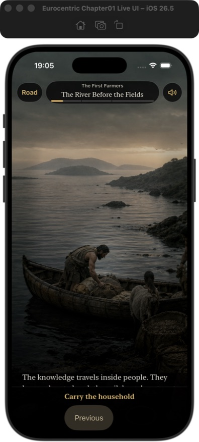
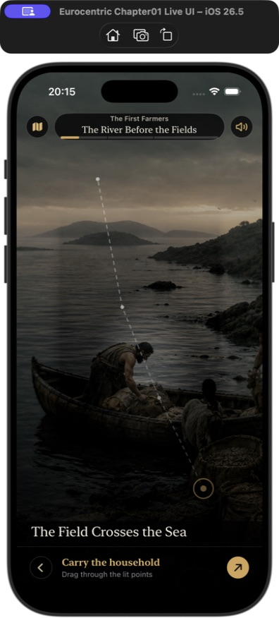
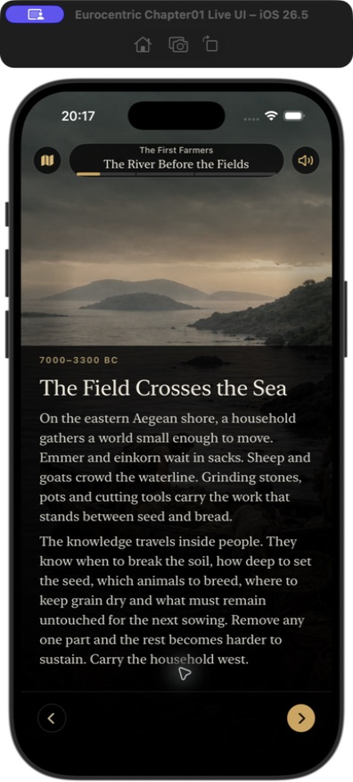
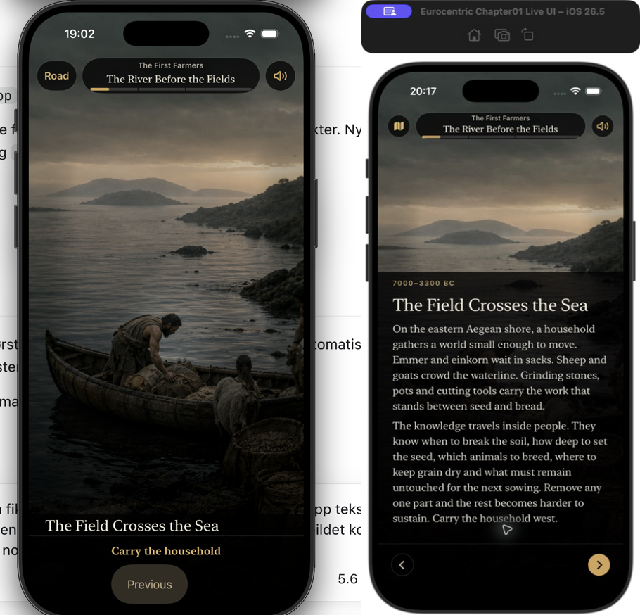
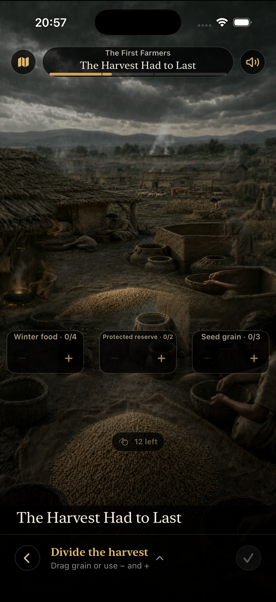
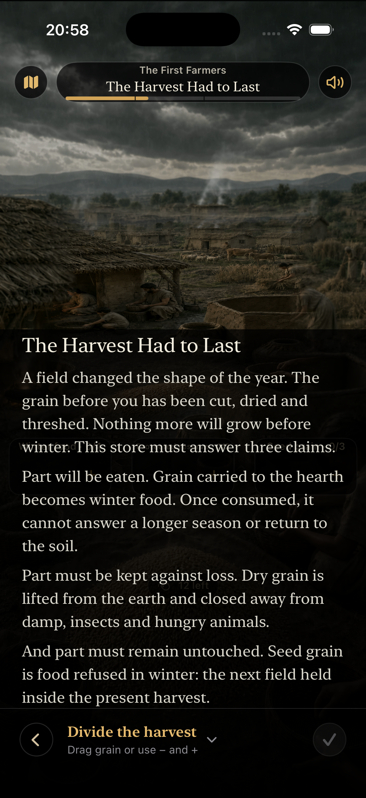
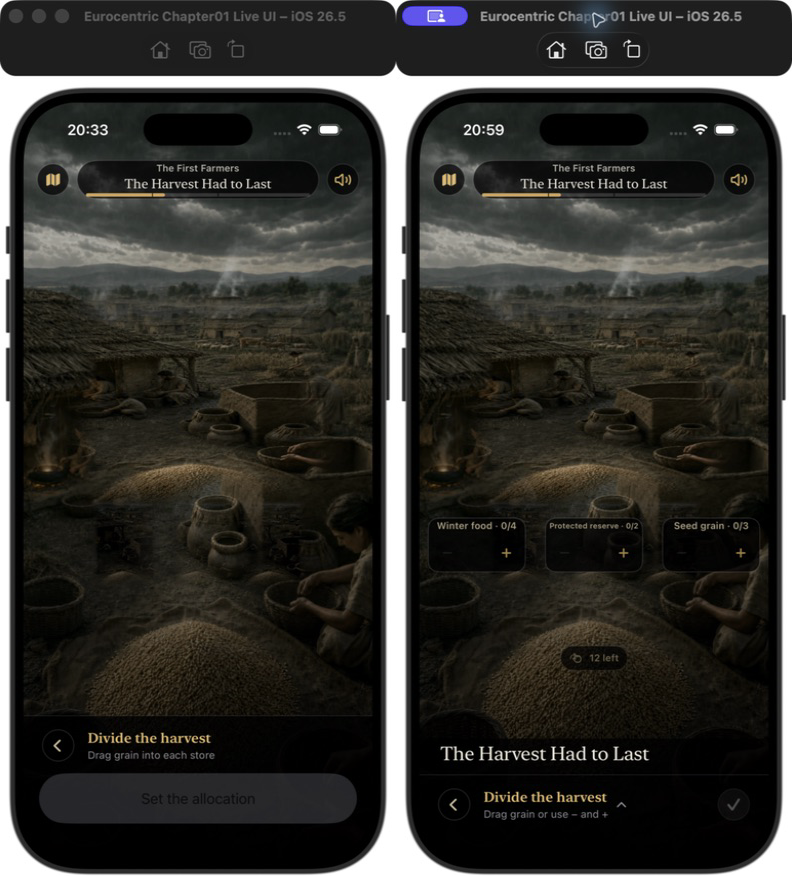
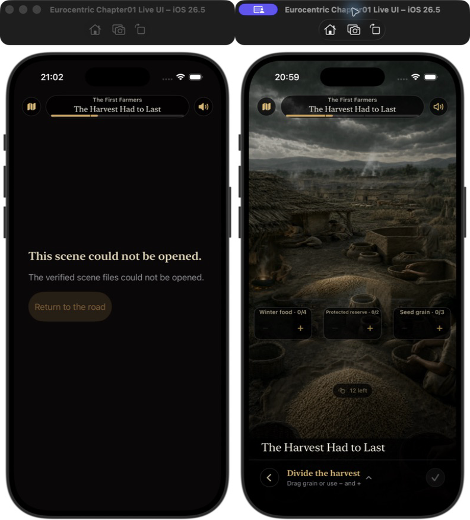

# UX-oppfølging: The Field Crosses the Sea

## Omfang

Kombinert UX- og tilgjengelighetskontroll av scenen på iPhone i portrettmodus. Målet var å kunne lese, forstå interaksjonen og komme videre uten at bildet eller navigasjonen tok over skjermen.

## Før og etter

## Kontrollert brukerreise

1. **Åpne scenen — god.** Bildet har fortsatt plass nok til interaksjonen, mens tittel, handling og tre kompakte kontroller er synlige. Tilbake, lyd og fremdrift har 44 × 44 punkters treffområder.
2. **Forstå ruten — god.** En svak stiplet linje og et markert neste punkt viser hvor brukeren skal begynne. Et vanlig trykk i bildet starter ikke lenger en ugyldig bevegelse eller viser feilen «That movement cannot continue».
3. **Lese teksten — god.** Et sveip opp i teksten utvider lesefeltet til 66 % i den interaktive scenen. Bildet blir mindre uten at scenens utsnitt eller berøringsgeometri endres. En bevisst nedtrekking ved toppen lukker lesefeltet igjen.
4. **Fullføre scenen — god.** Den diskrete diagonale pilen fører ruten gjennom alle fire punktene. Når ruten er ferdig, erstattes handlingen av en synlig høyrepil som går videre. Lagret leseposisjon kan ikke lenger blokkere neste handling.
5. **Gå tilbake og lese tidligere scener — god.** Forrige, neste og kart bruker kompakte ikoner ved vanlig tekststørrelse og beholder tekstetiketter ved tilgjengelighetsstørrelser. Review endrer ikke historisk fremdrift.

## Viktigste endringer

- I dokumentariske scener er score senket til 0,26, soundscape til 0,38, romlige detaljer til 0,34 og overganger til 0,32. I interaktive scener spiller primærtidslinjen bare fortellerstemmen; det responsive programmet er eneste eier av bakgrunnslagene.
- De fem responsive fasene er normalisert fra de forfattede forhåndsmålingene. Approach, waiting, engaged og consequence har et tak på −32 LUFS, mens den korte resistance-responsen har et tak på −29 LUFS. Ingen lag forsterkes for å nå målet.
- `Road`, `Previous`, `Continue`, review-navigasjon og Harvest-bekreftelsen bruker ikoner ved vanlig tekststørrelse. Tekstetiketter beholdes ved tilgjengelighetsstørrelser.
- Kontrollene ligger over hjemindikatoren og har en 36-punkters visuell form innenfor et 44-punkters treffområde.
- Scenen lagrer leseposisjonen og kan samtidig godta neste interaksjon. Endringer i scenevalg, verden, kamera eller interaksjonsresultat godtas fortsatt ikke gjennom denne mekanismen.

## Tilgjengelighet

- Accessibility XXXL fullfører samme trace-reducer og viser tekstmerkede handlinger.
- Ikonene har eksplisitte VoiceOver-navn og minst 44 × 44 punkters treffområder.
- Reduce Motion fjerner høydeanimasjonen, men beholder samme layoutendring.
- Skjermbilder kan ikke bekrefte VoiceOver-rekkefølge, fysisk lydnivå, kontrastmålinger eller oppførsel ved Siri, samtaler og hodetelefonfrakobling. Disse krever fysisk iPhone.

## Verifisering

- Den blokkerte scenen: scroll, fire rutepunkter og synlig Fortsett — bestått.
- Hele First Farmers: 17 scener og seks fysiske interaksjoner — bestått.
- Review forrige/neste — bestått.
- Accessibility XXXL trace — bestått.
- Reading-anchor og streng tilstandsavvisning — 6 av 6 tester bestått.
- Signert lydpayload og runtime-fixture — 15 av 15 tester bestått; generatoren er byte-identisk og aktuell.
- Lyd-/scene-regresjoner — 14 fokuserte Swift-tester og fire produksjons-UI-scenarier bestått.
- Ordinært Release-bygg og optimalisert `NON_SHIPPING_LIVE_TEST`-bygg — bestått.

## Oppfølging: Divide the Harvest

Den tidligere skjermen så låst ut fordi handlingen fylte hele det 18 % høye bunnpanelet. Tekstfeltet hadde praktisk talt ingen høyde, tre usynlige mål krevde tolv presise drag, og den eneste synlige knappen var deaktivert.

Dette er endret:

- Winter food, Protected reserve og Seed grain viser verdi og minimum direkte på scenen.
- Hvert lager har 44-punkters minus- og plusskontroller som sender de samme forfattede handlingene til samme reducer som drag og VoiceOver.
- Kornhaugen viser hvor mange av de tolv andelene som gjenstår.
- Bekreftelsen er et 44-punkters hakeikon i handlingsraden og aktiveres først når hele avlingen er fordelt og alle minimum er møtt.
- Handlingsraden åpner og lukker teksten med en synlig chevron. Dermed kan lesefeltet utvides uten å etterlate brukeren bak et panel som dekker alle interaksjonsmål.
- Direkte drag fra kornhaugen til lagrene er fortsatt tilgjengelig.

Ny produksjons-UI-test åpner og lukker teksten, kontrollerer at lagerkontrollene ikke overlapper, fordeler 4/2/6 uten skjulte koordinater, aktiverer haken og går videre. Den og den eksisterende fysiske dragtesten består.

## Oppfølging: feil etter første Harvest-valg

Feilen «The verified scene files could not be opened» skyldtes ikke manglende filer. Første fordeling var allerede lagret da en lydfase kunne løpe forbi den ventende cursor-overleveringen. En generell feilbane presenterte deretter lydfeilen som en innholdsfeil og erstattet hele scenen.

Dette er endret:

- En lydfase som overlapper approach→waiting-overgangen holdes tilbake til boundary-snapshotet er varig lagret og den nye cursor-autoriteten er aktiv.
- En feil i lydstart eller cursor-overlevering pauser lyden, lagrer posisjonen og viser `Resume sound`. Den ferdig reduserte Harvest-tilstanden forblir synlig og interaktiv.
- En avbrutt kombinert lydstart gjenoppretter scenekontrolleren etter at fortellerposisjonen er journalført. Neste trykk kan derfor ikke møte en foreldet presentasjon.
- Kombinerte responsive scener starter én primær komponent, fortellerstemmen, i stedet for fortellerlyd og et duplisert bakgrunnslag.

Regresjonstestene trykker første pluss umiddelbart etter lydstart og fremtvinger separat cursor-feil etter et lagret trykk. Begge fører Winter food videre fra 0 til 1 og 2 uten feilflate. Den komplette 4/2/6-fordelingen viser deretter `Continue`.
