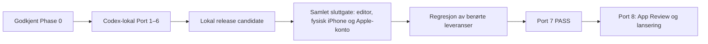

# Arbeidsbeskrivelse fra dagens tilstand til lansering

Status: `AUTHORITATIVE_PRODUCTION_SEQUENCE`

Produkt: `The Long West: EUROCENTRIC`

Denne planen styrer rekkefølge, avhengigheter, leveranser og go/no-go-porter
fra dagens native-grunnmur til et godkjent App Store-produkt. Autoritetsrekkefølgen
er fast: prosjektgrunnloven i `AGENTS.md`, `site/AGENTS.md` og `native/AGENTS.md`;
editor-godkjente kontrakter og approval records; maskinlesbare skjema og data;
produksjonsbiblene; deretter denne planen. En godkjenning gjelder bare det
eksplisitte omfanget og de uttrykkelige unntakene i sin approval record. En
komposisjonsgodkjenning kan derfor ikke godkjenne produksjonsassets, og en
kapittelgodkjenning kan ikke godkjenne lanseringspakken. En lavere eller mer
spesifikk planfil kan aldri overstyre grunnloven eller en editor-godkjent
kontrakt.

`IMPLEMENTATION_STATUS.md` dokumenterer hva som faktisk er bygget og bestått.
Denne filen beskriver arbeidet som gjenstår. En fase kan bare markeres ferdig
når porten nedenfor har konkrete testresultater og nødvendige godkjenninger.
`WORK_BREAKDOWN.md` er det operative følgedokumentet med navngitte
arbeidspakker, avhengigheter og avslutningsbevis. Det kan aldri flytte eller
senke en port i denne planen.

### Medium lock 30. juli 2026

Editor-in-chief har låst regissert sanntids-3D for hele Journey; se
[`blueprint/real-time-3d-medium-lock-2026-07-30.md`](./blueprint/real-time-3d-medium-lock-2026-07-30.md).
Beslutningen overstyrer alle 2.5D-spesifikke visuelle produksjonsinstruksjoner i
dette dokumentet. Den aktive planen inneholder derfor ingen lagdelte mastere,
clean plates, dybdelagspakker eller maskeinventar; den tidligere veien finnes
bare i git-historikk og eksplisitt merket prototypeevidens. Portene for
offlinelevering, restaurering, redaksjon, tilgjengelighet, lyd, integritet og
release gjelder fortsatt. Den visuelle produksjonslinjen utledes fra målte
sanntids-3D-bevis i Chapter 01 før produksjonen skaleres.

[`bibles/experience-bible.md`](./bibles/experience-bible.md) er den felles
porten for helhetsflyt. Før endelig offentlig ordlyd, sluttkunst eller full
kapittelproduksjon må opplevelsespakken, silent-greyboxen, full-run-testen og
læringsoverføringen der være gjennomført. De foreslåtte Chapter 01-tidene og
grepene kan ikke bli produksjonsstandard før greyboxen har bevist dem og
editor-in-chief har godkjent projeksjonen.

### Gjennomføringsrekkefølge uten løpende brukerinvolvering

Portene nedenfor er fortsatt releaseporter. I produksjonsrekkefølgen skilles
det nå mellom `LOCAL_COMPLETE` og `PASS`:

- `LOCAL_COMPLETE` betyr at Codex har fullført alt som kan produseres,
  inspiseres og testes lokalt, offline og i simulator, og har laget et ferdig
  beslutningsobjekt for eventuelle redaktørvalg.
- `PASS` krever i tillegg de oppførte redaktørgodkjenningene, fysisk
  iPhone-bevis og reelle Apple-tjenester der porten krever det.

Én redaktørport ligger uttrykkelig før Port 7: editor-in-chief må godkjenne
Chapter 01s nye opplevelsesprojeksjon og erstatningen av den gamle
bueprojeksjonen før sanntids-3D-arbeidet kan starte. Denne godkjenningen åpner
bare produksjonsløpet; den godkjenner ikke endelig ordlyd, motor, assets,
integrert kapittel eller shipping.

Et lokalt delresultat kan aldri omtales som en bestått scene, et bestått
kapittel eller releasebevis. Det kan likevel åpne neste Codex-lokale
arbeidspakke. Slik fullføres alt arbeid som ikke trenger brukeren før én samlet
sluttgate. Et valg eller en enhetstest i sluttgaten som endrer en foreløpig
baseline, utløser ny produksjon og regresjon av alle berørte leveranser før
release.

## 1. Ferdigtilstanden

Lanseringsproduktet er ferdig først når én og samme release candidate oppfyller
alle disse punktene:

- En spillbar prolog fører brukeren inn i én levende historisk verden.
- Alle 24 kapitler, alle buer eller erstatningsbevegelser i den gjeldende
  godkjente projeksjonen og alle 99 prinsipale nativeinteraksjoner er komplette.
  Samlet antall opplevelsesenheter og planlagte minutter utledes fra de samme
  bytebundne projeksjonene; den tidligere totalen på 55 buer og 722 minutter er
  ikke en varighetskvote etter en godkjent rebase.
- Hver godkjente bue eller erstatningsbevegelse holder sitt målte tidsrom, har
  naturlige stoppunkter og går inn i et uløst historisk trykk før forklaringen
  blir en innholdsside. Første handling følger et kapittelspesifikt, målt mål;
  det finnes ingen generell 90-sekundersfrist som kan legitimere passiv åpning.
- Brukeren handler direkte på en rute, ressurs, institusjon, kraft eller
  forvandling. Handlingen gir sanselig respons, viser mekanismen, skaper en
  konsekvens og etterlater et varig spor.
- De 48 verdenssporene, 106 bueeffektene og 152 senere aktiveringene fungerer
  som én kumulativ historie, også når kapitler åpnes fra alternative innganger.
- En avbrutt økt gjenopptas ved samme kausale punkt med korrekt scene,
  interaksjonstilstand, kamerastilling, tekstanker og lydposisjon.
- Alle installerte kapitler, bilder, interaksjoner, tilgjengelighetsalternativer,
  narrasjon og lyd fungerer uten nett.
- Prologen og de tre gratiskapitlene ligger i basisinstallasjonen. Ett permanent
  StoreKit-kjøp låser opp de resterende 21 kapitlene gjennom sju
  integritetskontrollerte pakker.
- Narrasjon og tidsstyrte captions er ordrett avledet fra samme godkjente
  engelske cue-manus. VoiceOver-beskrivelser og semantiske handlinger bygger på
  samme historiske autoritet og kan legge til nødvendig romlig eller operativ
  informasjon uten å endre påstand, konsekvens eller redaksjonell stemme. En
  kontinuerlig lesetekstversjon av nettsidemanuset er ikke et nativekrav.
  Narrasjon, score, soundscape, stillhet og haptikk er ferdig regissert gjennom
  hele verket.
- VoiceOver, alle Dynamic Type-størrelser, Increased Contrast og Reduce Motion
  gir samme historiske handling og konsekvens som standardopplevelsen.
- Det svakeste kapitlet holder det felles kunstneriske, redaksjonelle og
  tekniske nivået.
- Den daterte benchmarken dokumenterer konkret ledelse eller nødvendig paritet
  uten `DEFICIT` eller `NOT TESTED` i et kjerneområde.
- Appen, kjøpet og alle Apple-hostede pakker er godkjent av App Review.

Apple-featured-status er et mulig resultat, ikke en port vi kontrollerer. Vår
port er at det faktiske verket og presentasjonen tåler Apples vurdering.

## 2. Dagens utgangspunkt

`IMPLEMENTATION_STATUS.md` er eneste daterte sannhetskilde for gjennomført
arbeid, aktiv port og oppnådde antall. Denne planen forutsetter den godkjente
Phase 0-grunnmuren og beskriver alle senere avhengigheter uten å føre en
parallell fremdriftsstatus.

En fixture, komposisjonsskisse eller bestått kontrakttest teller ikke som en
ferdig scene. En scene teller i release-status først når den kan spilles med
produksjonsassets, lyd, tilgjengelighet, offlinebruk og restaurering på fysisk
iPhone. Før sluttgaten kan den bare være `LOCAL_COMPLETE`.

## 3. Regler for gjennomføringen

1. Brukeren er editor-in-chief. Bare brukeren kan endre tese, kausal ryggrad,
   redaksjonell vekt, sivilisatorisk standpunkt eller godkjent avslutning.
2. Codex skriver, produserer, bygger, tester, reviderer og styrer alle
   underverktøy. Ingen andre mennesker inngår i produksjonen.
3. Nye kostnader før inntekt er 0 kroner. En produksjonslinje med betalingskrav,
   betalingskort eller annen belastbar betalingslegitimasjon for verktøy eller
   tjenester, uklar kommersiell rett eller ikke-kommersiell lisens stopper ved
   porten. Skatte- og bankopplysninger som Apple krever for å utbetale inntekt
   er kontooppsett, ikke en tillatelse til å påføre prosjektet kostnader.
4. Research, kilder og F1–F7-funn forblir backstage. De kan korrigere et
   konkret faktum; de kan ikke legge inn balansering, historiografi eller en
   konkurrerende fortelling i produktet.
5. Hvert synlig og hørbart shippingasset trenger kilde eller modell,
   lisensgrunnlag, transformasjonshistorikk, hash og separat assetgodkjenning.
6. Codex skalerer ikke en uprøvd metode. Chapter 01s 3D-substrat, figur- og
   materialbevis, kontinuitets- og sannhetssnitt, komplette greybox og ferdige
   kvalitetscelle må lukke sine lokale porter før metoden skaleres til resten av
   verket. Releasemyndighet oppstår først når den samlede sluttgaten har gitt de
   samme leveransene `PASS`.
7. En senere forbedring av renderer, typografi, interaksjon, lyd, haptikk,
   tilgjengelighet, lagring eller pakking utløser revisjon av tidligere arbeid.
8. Ingen offentlig lanseringsdato fastsettes før alle 24 kapitler har bestått.
9. Releaseporter er binære: `PASS` eller `FAIL`. `LOCAL_COMPLETE` er en
   fremdriftsstatus for Codex-lokalt arbeid, ikke en tredje releasevurdering.
10. En uerstattelig master sikkerhetskopieres kryptert og hash-verifiseres straks
    den godkjennes, før destruktiv bearbeiding, eksport eller regenerering.
11. Returbehovet skal komme fra fortellingen og den forandrede verdenen. Quiz,
    XP, streaks, badges, samlegjenstander og kunstig hastverk kan ikke innføres
    som erstatning for narrativt trykk.

## 4. Kritisk produksjonslinje

Arbeid kan gå parallelt, og en lokal milepæl kan åpne neste lokale
arbeidspakke. Ingen senere leveranse kan kompensere for en feilet releaseport.

## 5. Port 1 — bevis sanntids-3D-substratet og nullkostkjeden

### Formål

Bevis at én avgrenset Chapter 01-celle kan eksistere som deterministisk,
interaktiv sanntids-3D på iPhone-portrett med klarerte rettigheter og null ny
kostnad. Porten beviser produksjonsmiddelet; den produserer ikke sluttkunst eller
fryser offentlig ordlyd.

### 3D-substrat og figur-/materialbevis

- Etter den ene tidlige editorporten: superseder den gamle Chapter 01-
  bueprojeksjonen, bind ny approval-digest og kontroller at kapittelkontrakt,
  seks interaction-ID-er og `WorldEffect`-er, avslutning og handoff er uendret.
  Regenerer alle avledede bue-/bevegelses- og varighetstotaler, approval-briefs
  og validatorforventninger. Bind deretter opplevelsespakken uten endelig
  offentlig ordlyd.
- Mål aktuelle native renderer- og verktøykandidater mot samme lille
  Chapter 01-celle før motor og assetkjede bindes.
- Bygg en enkel verdenscelle med versjonert scenegraph, stabil objekt- og
  tilstandsidentitet, regissert kamera, direkte touch, VoiceOver, Reduce Motion,
  offline pakkelast og eksakt restaurering.
- Bevis Chapter 01s erklærte figur- og materialsett ved faktisk portrettavstand.
  Inventaret eies av den godkjente kapittelprojeksjonen og kan ikke bli en
  global assetliste.
- Kontroller anatomi, bevegelse, historisk materialitet, lys, kontakt,
  okklusjon og lesbarhet gjennom de faktiske kameraene og handlingene.
- Bind alle fem interaksjonsgrammatikker til samme grammatikk-nøytrale
  domenedriver. Rendereren viser akseptert state; den kan ikke skape eller
  forfalske `WorldEffect`.
- Registrer verktøy, modell og versjon, lisens, prompt eller symbolsk kilde,
  parent-hasher, transformasjoner, avviste feil, slutt-hasher og backupstatus.
  Ingen ugjennomsiktig editorfil er eneste autoritative kilde.

### Lyd- og plattformbevis

- Dokumenter en kostnadsfri og kommersielt klarert stemme-, musikk-,
  lydeffekt- og haptikkjede.
- Produser seks anonyme engelske stemmekandidater mot samme verifiserte
  auditionsett og én uavbrutt tjue minutters stresstest for hver av de to
  sterkeste. Endelig stemme velges i den samlede sluttgaten.
- Bevis redigerbar score, kildebundet soundscape, regissert stillhet og det
  semantiske haptikksettet uten å produsere endelig Chapter 01-tidslinje.
- Bevar og koble innholdsprojeksjon, utviklingssignering, samplebundet lyd,
  write-ahead-lagring, atomisk installasjon, hashkontroll, rollback og
  nettverksnektet bruk uten avhengighet til den gamle 2.5D-compositoren.
- Lås repeterbar simulator- og fysisk enhetsprotokoll for frame time, minne,
  batteri, termikk, kaldstart, avbrudd og lagringspress. Fysisk kjøring og reelle
  Apple-tjenester ligger i Port 7.

### Utgangsport

Port 1 blir `LOCAL_COMPLETE` når 3D-substratet, figur-/materialbeviset, den
foreløpige lydkjeden og de ikke-visuelle plattformgrensene består lokalt fra en
signert offlinepakke. Det er fortsatt et teknisk og kunstnerisk bevis, ikke en
ferdig celle. `PASS` gis først i Port 7 mot den valgte motoren, eksakte
assetbytene og den fysiske testtelefonen.

Hvis den kostnadsfrie visuelle eller auditive kjeden er uttømt uten å nå nivået,
legges ett dokumentert valg frem når ingen annen lokal arbeidslinje kan
fortsette. Kvalitetskravet senkes ikke, og kostnader innføres ikke i det skjulte.

## 6. Port 2 — bevis Chapter 01-kontinuitet og historisk handling

Port 2 bruker den editor-godkjente Chapter 01-opplevelsesprojeksjonen og
substratet fra Port 1. De foreslåtte lengdene på kontinuitets- og
sannhetssnittene er `UNPROVEN` Chapter 01-hypoteser; de blir ikke franchisegrenser.

### Leveranser

- Bygg kontinuitetssnittet som er erklært i den godkjente Chapter 01-projeksjonen.
  Ingen identitet, last eller kausal state kan byttes ut i overgangen.
- Bygg kapittelprojeksjonens sannhetssnitt. Tidligere handling må vende tilbake
  som fysisk konsekvens og skape neste forpliktelse.
- Kjør begge snittene uten narrasjon, captions eller score. Problem, avhengighet,
  handling, konsekvens og handoff skal leses fra mennesker, materiale, rom og
  lydkilder.
- Kjør natural first-use, standard touch, VoiceOver og Reduce Motion gjennom
  samme domenestater. Logg nøling, passiv tid, respons og misforståelser.
- Tvangsavslutt under hver handling og overgang; gjenopprett eksakt kamera,
  materialstate, interaksjon og lydposisjon uten recovery-kontroll.
- Pakk snittene i utviklingens signerte, nettverksnektede tillitsdomene og mål
  de lokale ytelses-, minne- og lagringsgrensene.
- Bygg om et intervall som mister kausal forståelse før neste vending. Kutt det
  hvis vendingen ikke skaper en ny historisk konsekvens.

### Utgangsport

Port 2 blir `LOCAL_COMPLETE` når begge snitt består silent-, first-use-,
tilgjengelighets-, offline- og restaureringsporten, og ett bytebundet
beslutningsobjekt viser hva 3D faktisk løste, hva som måtte bygges om og hvilke
Chapter 01-hypoteser som fortsatt er `UNPROVEN`. Full kapittelgreybox følger i
Port 3; de tidligere fem 2.5D-laboratoriescenene er ikke en avhengighet.

## 7. Port 3 — bygg hele `The First Farmers`

Dette er første fullstendige bevis på produktet. Den gjeldende godkjente
projeksjonen består av tre buer og 28 minutter; den foreslåtte, kortere
3D-omarbeidingen erstatter den først når editor-in-chief godkjenner Chapter
01-opplevelsesprojeksjonen. Porten følger den sist godkjente projeksjonen og
gjør ingen av tidsmålene til felles standard.

### Arbeid

- Projiser den godkjente kapittelkontrakten til opplevelsespakken i
  `bibles/experience-bible.md`, uten å fryse endelig offentlig ordlyd.
- Bygg hele Chapter 01 og handoffen som én komplett greybox. Kjør silent-,
  first-use-, full-run-, tilgjengelighets- og restaureringsbeviset; bygg om
  svake intervaller, kutt tomme vendinger og klassifiser læringene før
  sluttproduksjon.
- Bygg den komplette spillbare prologen og overgangen inn i Chapter 01, slik at
  vertikalsnittet starter ved kald installasjon og ender i et permanent
  verdensspor.
- Frys deretter kanonisk offentlig manus og beatdata fra den målte flyten. Kjør
  konkret F1–F7-verifikasjon backstage og redaksjonell regresjonsport.
- Produser først én ferdig thessalisk kvalitetscelle med geometri, materialer,
  rigg eller tilstandsautorisert animasjon, lys, interaksjon, lyd og ytelse.
  Mål revisjons- og assetmetoden før den skaleres.
- Produser deretter de fire øvrige 3D-verdenscellene, alle overganger,
  interaksjoner, stillhetsbeats, tilstander og atmosfære.
- Produser narrasjon i lange opptak, del den ved naturlige pust og bind hver cue
  til manus og lydposisjon.
- Komponer score, soundscape, stillhet og haptiske hendelser for hele kapitlet.
- Bygg alle tilgjengelighetsrepresentasjoner fra samme manus og domenehandlinger.
- Bygg kapitlet i en signert, ikke-shipping vertikalsnittpakke med samme
  integritets-, offline- og restaureringsgrenser som lanseringspakkene. Den kan
  ikke bruke eller hevde fullføring av `essential-free-v1`.
- Bevis alle verdensspor og handoff til `The Steppe Comes West`.
- Hold grensesnitt- og innholdsstrenger atskilt med stabile lokaliserings-ID-er,
  og kjør én pseudolokalisert layouttest. Engelsk er eneste launchspråk, men
  arkitekturen skal ikke kreve senere omskriving av 24 kapitler.
- Logg faktisk produksjonsvolum, antall revisjoner, assetstørrelse, byggetid og
  tilbakeføringer. Disse dataene skal brukes til produksjonsprognosen for de
  resterende kapitlene.

### Vertikalsnittport

- Åpningen består kapitlets godkjente og målte first-action-mål; den kan ikke
  bruke en generell 90-sekundersmargin.
- Alle buer eller erstatningsbevegelser i den sist godkjente projeksjonen holder
  narrativt trykk gjennom sitt målte tidsrom og har naturlige stoppunkter.
- Brukeren kan forlate appen ved hvert beat og under hver interaksjon uten tap.
- Kontrollert lydpause gjenopptas sample-eksakt. Hard-kill gir høyst 250 ms
  lydavvik og åpner med lyd pauset.
- Kaldstart viser gjenopprettet bilde innen 1,5 sekunder og full interaktivitet
  innen 2 sekunder.
- Simulatoren og automatiske instrumenteringsbaner viser ingen kjent
  overskridelse av 60 fps-målet, p99 frame time under 25 ms eller vedvarende
  minne under 500 MB. Termikk, batteri og faktisk gulvytelse forblir uprøvd
  frem til Port 7.
- Hele kapitlet kan installeres, fullføres, tvangsavsluttes og gjenopptas i
  flymodus.
- VoiceOver, alle Dynamic Type-størrelser, Increased Contrast og Reduce Motion
  består gjennom hele kapitlet.
- Konkurrenttilgjengelighet og versjoner re-sjekkes, og en ny datert
  benchmarkgjennomgang lagrer opptak, lyd og testbevis fra dette eksakte
  vertikalsnittet.
- Benchmarken viser ledelse over Paladin på kausal interaksjon, narrativ kommando
  og kumulativ verden, paritet med The Room på taktilitet og paritet med Audible
  på offline posisjonsrestaurering.
- Codex legger frem én komplett anbefalt opplevelse med bytebundne manus-,
  bilde- og lydobjekter. Editor-in-chief godkjenner den på fysisk iPhone i
  Port 7.
- Produksjonsmetoden kan gjentas 23 ganger uten særskilt håndarbeid utenfor
  Codex.

Codex skalerer først den lokale metoden når hele kapitlet er
`LOCAL_COMPLETE` og bilde-, lyd- og revisjonsgjennomstrømningen er målt.
Dette åpner lokal produksjon, ikke shipping eller en portpåstand. Port 3 får
`PASS` først etter den samlede redaktør- og enhetsrunden i Port 7.

## 8. Port 4 — prolog, levende verden og gratistriad

### Produktskallet

- Integrer den allerede ferdige prologen i det komplette produktskallet og la
  den åpne alle tre gratis veier.
- Bygg den levende verdenen som primær hjem- og returflate, uten kortbibliotek.
- Vis nåværende sted, ferdige spor, neste historiske trykk og senere
  aktiveringer gjennom samme verden.
- Åpne de tre gratis veiene etter prologen. Ingen konto, betalingsdialog eller
  varslingsforespørsel kommer først.
- Vis kjøpsflaten først når brukeren selv velger en låst vei. Ett kjøp åpner
  hele lanseringssamlingen; det finnes ingen kapittelvis oppsalgslinje.
- Bygg låste veier, kapitteloverganger, nøyaktig retur og valgfri reorientering
  etter lengre fravær.
- Bygg innstillinger for narrasjon, lyd, tilgjengelighet, lagring og
  nedlastinger uten å gjøre dem til en parallell opplevelse.
- Start narrasjon og dramatisk lyd først etter et uttrykkelig brukervalg. En
  kald retur gjenoppretter lydposisjonen, men åpner alltid pauset.

### Gratistriaden

- Lukk opplevelsespakke og komplett greybox for `The Frontiers Hold` og
  `The European World` før endelig offentlig ordlyd, sluttkunst eller full
  assetproduksjon.
- Ferdigstill `The Frontiers Hold` (`europe-holds-the-line`).
- Ferdigstill `The European World` (`european-world`).
- Tilbakefør alle forbedringer fra Chapter 13 og 21 til `The First Farmers`.
- Bygg basisinstallasjonen som appskall og prolog pluss den faktiske
  `essential-free-v1`-pakken med de tre komplette kapittel-ID-ene. Selve
  gratispakken skal holde seg innen 750 MB og kan ikke hevde eierskap til
  prologen uten en senere eksplisitt skjemaendring.

### Kjøp og levering

- Implementer én ikke-forbrukbar StoreKit-rettighet for hele samlingen.
- Implementer kjøp, avbrudd, pending, restore, refund og revocation.
- Test uverifisert transaksjon/signatur, transaksjon ferdig etter prosessrestart,
  allerede eid produkt, restore uten tidligere kjøp, reinstallasjon og
  entitlement-gjenoppbygging, Apple-ID/storefront-skifte, kjøp uten nett og
  kappløp mellom refund/revocation og allerede installert innhold.
- Bevar verifisert eierskap lokalt slik at installerte kapitler virker offline.
- Implementer Apple-Hosted Background Assets med enkeltnedlasting og
  `Download all`.
- Implementer pause, gjenopptakelse, nettutfall, lite lagringsplass, feil hash,
  feil signatur, atomisk aktivering, oppdatering og rollback.
- Avvis inkompatibelt skjema eller minimum runtime, feil pakke-ID eller
  entitlement, feil størrelse, path escape, manglende eller erstattet fil etter
  aktivering og digestendring før decode.
- Test appoppdatering under delvis nedlasting, prosessdød under pause/resume,
  eldre pakkeversjon og full-disk recovery. Sist verifiserte installasjon og
  progresjon skal alltid overleve.
- Bygg et versjonert migreringsregister for gamle saves, interaksjonstilstander,
  narrasjonsposisjoner og world state. Test avbrutt migrering, rollback,
  gjeninstallasjon av innholdspakken og gjenåpning med både eldre og nyere
  pakkeversjon.
- Før de lokalt verifiserte tjenesteadapterne og identifikatorkontraktene inn i
  produksjonsarkitekturen. Den signerte tjenestespiken kjøres mot samme grenser
  i Port 7.

### Utgangsport

Port 4 blir `LOCAL_COMPLETE` når alle tre gratis kapitler holder samme
foreløpige nivå, produktskallet er ferdig, kjøps- og leveringsarkitekturen
består komplette lokale feilmatriser, og den installerte gratistriaden kan
brukes i simulatorens nettverksnektede bane. `PASS` krever den reelle
StoreKit-/Background Assets-runden, fysisk flymodus og editorens godkjenning i
Port 7. Ingen gratisvei kan være et svakere lokkemiddel eller en teknisk
demonstrasjon.

## 9. Port 5 — produser de 21 betalte kapitlene

Produksjonen følger fire bølger:

1. Chapters 02–06.
2. Chapters 07–12.
3. Chapters 14–20.
4. Chapters 22–24.

Chapter 13 og 21 er ferdige gjennom gratistriaden. Den utsatte øst-romerske
fortsettelsen etter 565 skal ikke avlede lanseringsproduksjonen.

### Kapittelpipeline

Hvert kapittel går gjennom samme sekvens:

1. Oversett den godkjente kontrakten til opplevelsespakken i
   `bibles/experience-bible.md`, med spillbar premiss, trykkurve,
   handling–avhengighet–konsekvens-ledger, overgangs- og identitetskart,
   menneskelig eller institusjonell ryggrad, sanseplan, narrasjonsfunksjoner og
   restaureringsankere.
2. Bygg hele kapittelet som greybox. Kjør silent-, first-use-, full-run-,
   tilgjengelighets- og restaureringsbeviset, bygg om eller kutt svake
   intervaller og klassifiser alle læringer før sluttkunst eller endelig ordlyd.
3. Skriv offentlig manus i den godkjente stemmen fra den målte flyten. Hver bue
   følger sin kausale bevegelse; ro og stillhet må endre forståelse, forventning
   eller følelse, ikke bli tomrom mellom tekstblokker.
4. Verifiser konkrete påstander backstage, lukk alle F1–F7-funn og kjør
   redaksjonell regresjon. Bevar Codex' anbefalte redaksjonelle baseline som et
   bytebundet redaktørobjekt; endelig offentlig tekstgodkjenning skjer samlet i
   Port 7.
5. Kontroller kilde, lisens, kommersiell rett og planlagt proveniens før et
   visuelt eller auditivt asset genereres eller transformeres. Registrer
   provenienslinjen gjennom hele produksjonen.
6. Lag en hovedretning som viser kapittelets egen mekanisme, materialitet og
   historiske verden. Bevar anbefalt retning og avviste alternativer for samlet
   redaktørvalg i Port 7.
7. Produser ferdige 3D-verdensceller, scenegraph, geometri, materialer,
   teksturer, rigg eller tilstandsautorisert animasjon, lys, kamera og atmosfære.
8. Bind alle prinsipale interaksjoner til riktig grammatikk, domenehandling og
   `WorldEffect`.
9. Spill en komplett produksjonsversjon med tekst, timing, visuell retning og
   interaksjoner. Juster pacing innen den godkjente kontrakten, kjør ny
   faktasjekk/regresjon på endret tekst og frys en foreløpig lokal tekstlås.
10. Produser foreløpig komplett narrasjon, uttaler, score, soundscape, stillhet
   og haptikk. De blir mastere først etter sluttgaten.
11. Produser VoiceOver-rute, Dynamic Type-layout, Increased Contrast og Reduce
   Motion med full konsekvensparitet.
12. Bind foreløpige assethasher straks filene fryses, lag separate
    godkjenningsobjekter og integrer deretter en signert lokal testpakke.
13. Test hele kapitlet i flymodus. Kontrollert lydpause skal være sample-eksakt;
    hard-kill skal avvike høyst 250 ms og kald retur skal ha lyd pauset.
14. Tvangsavslutt ved hvert beat og ved 0, 25, 50, 75 og 100 prosent av hver
    hovedinteraksjon.
15. Test bakgrunning, simulerte lydruteendringer og prosessdød ved alle
    narrasjonscues. Reell Siri-/telefonavbruddsmatrise flyttes til Port 7.
16. Kjør all tilgjengelig simulatorprofilering. Ytelse, termikk, batteri,
    lagring og komplett gjenopprettelse på fysisk telefon kjøres samlet i Port
    7.
17. Sammenlign kapitlet med det sterkeste ferdige kapitlet og relevante
    benchmarkprodukter.
18. Legg kapitlet i den bytebundne sluttgatekøen for editor-in-chief og den
    fysiske telefonen.

For Chapter 24 kommer én særport før asset- og kapittelgodkjenning: hele det
offentlige manuset skal gjennom en fersk primærkildeverifikasjon under
faktalåsen `As of 20 July 2026`. Alle tidsavhengige påstander kontrolleres på
nytt; hver institusjonelle og finansielle påstand etter 2024 bindes særskilt til
en datert primærkilde. Porten gjenåpner ikke den godkjente tesen, kausale
ryggraden, narrative vekten eller styrende dommen.

### Produksjonsflyt

Etter lokalt komplett Chapter 01 kan tre arbeidslinjer gå forskjøvet:

- neste kapittel er i manus og faktaverifikasjon;
- gjeldende kapittel er i visuell og auditiv produksjon;
- forrige kapittel er i integrasjon, enhetstest og QA.

Codex kan parallellisere arbeid innen linjene. Offentlig manus, hovedretning og
kapittelintegrasjon forblir sekvensielle innen hvert kapittel. Uerstattelige
foreløpige mastere sikkerhetskopieres straks de fryses. Work in progress er
maksimalt ett kapittel per linje. En navngitt utvidelse krever en eksplisitt
lokal kvalitetsrapport og kan ikke opprette en ubegrenset kø av ureviewede
manus, visuelle retninger eller lydidentiteter.

### Bølgeport

- Hvert kapittel er `LOCAL_COMPLETE` med et ferdig sluttgateobjekt.
- Det svakeste kapitlet er sammenlignet med det sterkeste.
- Forbedringer av felles systemer er tilbakeført til alle berørte kapitler.
- Ferdige leveransegrupper passer sine bytebudsjetter.
- Ingen midlertidig asset, uklar rettighet, åpen faktasak eller midlertidig
  lydcue står igjen.
- Codex åpner neste lokale bølge når ingen kjent lokal kvalitetsfeil gjenstår.
  Editor-in-chief gir samlet go/no-go for de ferdige bølgene i Port 7.

## 10. Port 6 — content complete, samlet verden og fremtidig innhold

### Samlet lanseringsverk

- Spill gjennom alle handoffs, seeds, verdensspor, senere aktiveringer og
  transformasjoner som ett verk.
- Åpne hvert kapittel både kronologisk og fra alle tillatte alternative
  innganger.
- Rekonstruer fullført historie i samlingsrekkefølge slik at samme historikk
  alltid gir samme world state.
- Kompiler først usignerte kandidater for basispakken og de sju betalte
  pakkene. Frys `collection`, payload, komplett offentlig filinventar og alle
  digests for hver pakke.
- Før pakken som inneholder Chapter 24 kan godkjennes, bindes den ferske
  primærkildeverifikasjonen til det eksakte offentlige filinventaret og
  payloadhashen.
- Bevar de åtte eksakte pakkeinventarene som bytebundne sluttgateobjekter.
  Editor-in-chief godkjenner dem i Port 7; denne pakkegodkjenningen er separat
  fra kapittelgodkjenning.
- Opprett og oppbevar produksjonens P-256-private nøkkel utenfor repoet med
  eierbegrensede filrettigheter, stabil key-ID og hash-verifisert backup. Pin den
  betrodde offentlige nøkkelen utenfor pakken og dokumenter rotasjonsprosedyren.
- Bruk utviklingens separate tillitsdomene for lokale kandidater. Signer de
  endelige åtte pakkene med produksjonsnøkkelen først etter pakkegodkjenningen
  i Port 7, størrelseskontroller dem og bygg den samlede lanseringskandidaten.
- Kjør samlet replay av alle 24 kapitler to ganger og krev identisk endelig
  SHA-256.
- Test kjøp, restore og offline eierskap mot de eksakte releasepakkene.
- Test nedlastingsavbrudd, nettutfall, lite lagringsplass, feil hash/signatur,
  oppdatering og rollback uten tap av tidligere installasjon eller progresjon.

### Fremtidig dypdykk

- Bygg én upublisert prøvepakke med ny, stabil innholds-ID.
- Bruk en separat offentlig source root med én `Release`, tilhørende payload,
  eget bytebundet godkjenningsobjekt og komplett assetproveniens. Den kan ikke
  låne launchpakkenes godkjenningsmyndighet; endelig editorgodkjenning samles i
  Port 7.
- Fest dypdykket til korrekt tid og sted i den eksisterende verdenen.
- La pakken lese relevant tidligere world state.
- Last den ned og aktiver den uten ny runtimekode.
- Hvis et dypdykk trenger en ny runtimefunksjon, må funksjonen leveres i en
  godkjent appoppdatering før pakken kan publiseres.
- Bevis komplett offlinebruk etter installasjon.
- Bevis katalog, deduplisering og varslingsintensjon lokalt. Publiser den i den
  reelle testkatalogen og send nøyaktig ett CloudKit/APNs-varsel i Port 7, når
  testinnholdet faktisk er tilgjengelig.
- Be om varslingsrettighet først etter at brukeren har opplevd historien.
- Test tillatelse som ubestemt, godkjent og avslått; duplikat release-event,
  avsluttet app, offline enhet, korrekt deep link og en pakke som ennå ikke er
  ferdig aktivert. Ingen tilstand kan gi mer enn ett varsel, og varselet kan
  ikke sendes før innholdet faktisk er tilgjengelig.

Betalingsmodellen for senere dypdykk avgjøres etter inntekt og er ikke del av
lanseringsporten.

### Budsjettport

- Appskall og motor: maksimalt 100 MB.
- `essential-free-v1`: maksimalt 750 MB.
- Hver betalt trekapittelpakke: maksimalt 750 MB.
- Hele installerte lanseringsverket: maksimalt 6 GB.

### Content-complete-port

- Alle 24 kapitler, alle buer eller erstatningsbevegelser i gjeldende godkjent
  projeksjon og 99 prinsipale interaksjoner er lokalt ferdige og samlet som
  bytebundne godkjenningsobjekter.
- En komplett simulatorgjennomspilling av hele verket og alle pakkeoverganger
  er lagret som lokalt bevis.
- Alle kapitler har bestått samme lokale kapittelport; ingen kjent midlertidig
  fil, åpen faktasak, uklar rettighet eller manglende
  tilgjengelighetsvariant står igjen.
- Svakeste kapittel er sammenlignet med sterkeste, og felles forbedringer er
  tilbakeført.
- Benchmarksettet er re-sjekket på dato og har ingen kjerne-`DEFICIT`.
- Hver prinsipal interaksjon kan begrunnes av den konkrete historiske
  mekanismen i sitt eget kapittel; en generisk interaksjon består ikke selv om
  den teknisk bruker riktig grammatikk.
- Poleringen er fordelt gjennom hele verket og er ikke konsentrert i prolog
  eller gratistriad.

Port 6 blir `LOCAL_COMPLETE` når budsjettporten og den lokale
content-complete-porten består, alle åtte kandidater fungerer separat og
samlet i utviklingens tillitsdomene, den kumulative verdenen er deterministisk,
og dypdykkssystemet er lokalt bevist uten egen server eller ny runtimekode.
`PASS` gis i Port 7 etter bytegodkjenning, produksjonssignering, fysisk
gjennomspilling og reell Apple-tjenesterunde.

## 11. Port 7 — release candidate

Release candidate gjelder de eksakte bytefilene som skal sendes til Apple.

### Samlet sluttgate

Port 7 er første punkt der prosjektet krever den fysiske iPhonen og all videre
aktiv involvering fra editor-in-chief etter den ene tidlige godkjenningen av
Chapter 01s opplevelses- og bueprojeksjon. Codex legger da frem ferdige,
anbefalte og bytebundne beslutningsobjekter samlet: fortellerstemme, 3D-substrat,
kontinuitets- og sannhetssnitt, ferdig Chapter 01-kvalitetscelle, prolog,
kapittelmanus og hovedretninger, alle 24 integrerte kapitler, åtte
pakkeinventarer, pris og App Store-presentasjon. Nødvendige Apple-kontohandlinger
gis som én konkret sjekkliste.

Redaktørvalg fryses før produksjonsmastere og releasepakker signeres på nytt.
Deretter kjøres all berørt regresjon. Den fysiske telefonen brukes først når
det finnes én sammenhengende kandidat å måle, og reelle Apple-tjenester testes
mot den samme versjonssammenhengen.

### Full funksjonell matrise

- Alle 24 kapitler, alle buer eller erstatningsbevegelser i gjeldende godkjent
  projeksjon og 99 prinsipale interaksjoner er ferdige.
- Alle tidligere porter er `LOCAL_COMPLETE`; de får `PASS` mot samme appbygg
  og de samme pakkehashene gjennom denne sluttgaten.
- Ingen testlinje står som `NOT TESTED`.
- Hvert av de 24 kapitlene gjennomspilles og måles på prosjektets ene fysiske
  testtelefon med samme RC-bygg og eksakte pakkehash. Rapporten navngir modell
  og iOS-versjon. Hvis telefonen er nyere enn iPhone 15 Pro, registreres den
  allerede godkjente enkelt-enhetsrisikoen uten å late som testen ble kjørt på
  gulvmodellen.
- Tvangsavslutning ved hvert beat og ved alle definerte interaksjonspunkter
  består.
- Kontrollert lydpause er sample-eksakt; hard-kill-avvik er høyst 250 ms.
- Bakgrunning, lydruteendring, Siri-/telefonavbrudd og prosessdød består ved alle
  narrasjonscues; kald retur åpner alltid med lyd pauset.
- Kaldstart, full bruk, avslutning og restaurering består i flymodus.
- StoreKit purchase, avbrudd, pending, restore, refund og revocation består.
- Hele StoreKit-feilmatrisen fra Port 4 kjøres på nytt mot RC-entitlement og
  eksakte releasepakker.
- Alle download-, integritets-, oppdaterings- og rollbackfeil består uten tap av
  installert innhold eller progresjon.
- Feil skjema/minimum runtime, pakke-ID/entitlement, filstørrelse, path escape,
  manglende/erstattet fil og digestendring før decode avvises. Appoppdatering
  under nedlasting, prosessdød under pause/resume, eldre pakke og full disk
  bevarer sist verifiserte installasjon og progresjon.
- Basispakken og alle sju Apple-hostede pakker verifiseres med den offentlige
  P-256-nøkkelen som faktisk er innbakt i samme RC-arkiv. Feil eller rotert
  key-ID skal avvises før aktivering.

### Fysisk ytelse

- 60 fps på den fysiske testtelefonen.
- p99 frame time under 25 ms.
- Synlig respons begynner innen 50 ms for hver prinsipale interaksjon.
- Vedvarende minne under 500 MB.
- Gjenopprettet bilde innen 1,5 sekunder og full interaktivitet innen 2 sekunder.
- Ingen alvorlig termisk tilstand etter 30 minutter.
- Det numeriske batteribudsjettet og lagringspressprotokollen som ble låst i
  Port 1 består for hvert kapittel.

### Kunstnerisk og redaksjonell nulliste

- Ingen uavklarte anakronismer, anatomifeil, geometri-, material-, animasjons-,
  lys-, okklusjons- eller streamingfeil, feiluttaler, lydskjøter eller
  syntetiske kadensbrudd.
- Ingen backstage-data, kilder, evidensfelt, confidence-data, metodikk,
  historiografi eller akademisk regresjon i offentlige pakker.
- Allowlist-skann kjøres på hver bytefrosne offentlige pakke. Negative
  injeksjonstester beviser at backstage-stier, forbudte skjemafelt og akademiske
  lekkasjefraser stanser bygg og signering.
- Hele Chapter 24s offentlige pakke har passert en fersk
  primærkildeverifikasjon under faktalåsen `As of 20 July 2026`. Alle
  tidsavhengige påstander er kontrollert på nytt, og hver institusjonelle og
  finansielle påstand etter 2024 er bundet til en datert primærkilde, uten å
  åpne den godkjente kontrakten.
- Narrasjon og tidsstyrte captions samsvarer ordrett med samme godkjente
  cue-manus. VoiceOver kan legge til nødvendig romlig og operativ informasjon
  uten å endre den historiske påstanden eller sluttilstanden.
- Hver scene og skjerm har logisk VoiceOver-rekkefølge, fullførbar semantisk
  handling, samme slutthash som standardinput og tap-/step-alternativ for drag
  og hold.
- Ingen Dynamic Type-størrelse gir avkorting, overlapp eller interaktive mål
  under 44 pt. Increased Contrast er lesbart, og Reduce Motion beholder samme
  kausale overlays og forgrunnsokklusjon.
- Kvaliteten er fordelt gjennom hele verket og tåler særskilt gjennomgang av
  det svakeste kapitlet.

### Benchmark og App Store-materiale

- Oppdater konkurrentversjoner og App Store-presentasjon for det daterte
  benchmarksettet.
- Dokumenter hver benchmarkdimensjon med faktisk build, opptak, lyd eller
  testresultat.
- RC feiler ved et kjerne-`DEFICIT`, ved `NOT TESTED`, når svakeste kapittel
  ligger under det sterkeste relevante sammenligningsproduktet, når poleringen
  er konsentrert i åpningen, eller når en interaksjon ikke kan begrunnes av
  kapittelets konkrete historiske mekanisme.
- Fastsett engangsprisen.
- Produser ikon, screenshots, App Preview, produkttekst,
  personvernopplysninger og IAP-presentasjon fra det ferdige verket.
- Kontroller gjeldende App Review-regler, Human Interface Guidelines,
  personvernkrav og StoreKit-krav mot Apples offisielle dokumentasjon.
- Forbered en sannferdig redaksjonell featuring-henvendelse som viser det
  faktiske produktet uten påståtte priser eller kvalitetsstempler.
- Frys og versjonsbind metadata, screenshots, App Preview, personvernsvar,
  StoreKit-ID/pris, asset-pack-versjoner, CloudKit-skjema/releasekatalog og
  pushkonfigurasjon sammen med RC-beviset.
- Deploy skjema, indekser og security roles fra CloudKit development til
  production. Verifiser produksjons-container-ID, APNs-entitlements og
  releasekatalog mot RC. Produksjonsoppføringer for upublisert innhold forblir
  inaktive og kan ikke utløse varsel før faktisk publisering.
- Arkiver RC med produksjonssignering, samme versjons- og byggnummer som
  bevispakken, og valider den distribuerte arkivfilen før opplasting.
- Fullfør aldersgrense, eksport-/krypteringserklæring, Privacy Manifest,
  App Privacy-svar, territorier og tilgjengelighet. Kontroller at Paid Apps-
  avtalen samt nødvendige skatte- og bankopplysninger er aktive; handlinger i
  Apple-kontoen legges frem for brukeren og kan ikke simuleres av Codex.
- Skriv konkrete App Review-notater og testinstruksjoner for prolog,
  gratisveier, kjøp, restore, pakker og offlinebruk. Produktet krever ingen
  demokonto.
- Editor-in-chief godkjenner release candidate og de eksakte offentlige
  bytefilene.

Port 7 består bare når samme RC-bygg og de eksakte åtte pakkehashene har bestått
hele funksjons-, ytelses-, lyd-, tilgjengelighets-, offline-, integritets- og
benchmarkmatrisen; produksjonsnøkkel, CloudKit/APNs, App Store-materiale og
kontokrav er versjonsbundet til samme kandidat; og editor-in-chief har godkjent
de eksakte offentlige bytefilene.

## 12. Port 8 — App Review, lansering og første drift

- Fullfør storefrontpris og metadata for det allerede opprettede
  StoreKit-produktet, sett det til `Ready to Submit` og send det sammen med
  appversjonen.
- Send appbygg, IAP og de sju Apple-hostede pakkene til App Review.
- Lukk konkrete tekniske eller policyrelaterte reviewfunn. Et reviewfunn åpner
  ikke den redaksjonelle profilen uten et konkret plattformkrav som legges frem
  for editor-in-chief.
- Etter godkjenning: installer den eksakte Apple-prosesserte binæren gjennom
  intern distribusjon på prosjektets testtelefon. Kjør sandboxkjøp og restore,
  velg `Download all`, verifiser og aktiver alle sju Apple-hostede pakker, slå
  av nettet og åpne minst ett kapittel fra hver av de åtte payloadene. Spill
  narrasjon og en prinsipal interaksjon, tvangsavslutt og gjenoppta lagret state.
- Gjenta produksjonssmoke for CloudKit-katalog og APNs mot den godkjente
  binæren.
- Kontroller at storefront, pris, IAP, personvern og pakker samsvarer med RC.
- Hold tilbake release dersom den Apple-godkjente binæren eller pakkeversjonen
  avviker fra den godkjente RC-en.
- Editor-in-chief gir eksplisitt publiseringsgodkjenning.
- Overvåk MetricKit og App Store Connect Analytics uten tredjepartsanalyse.
- Etter manuell publisering kontrolleres den første naturlige
  produksjonstransaksjonen i App Store Connect uten et betalt testkjøp fra
  prosjektet. Siden appen ikke sender tredjepartsanalyse eller egen telemetri,
  kan et produksjonsproblem med entitlement først påvises gjennom Apples
  diagnostikk eller en brukerrapport. Ved et slikt funn stanses videre
  promotering og tilgjengeligheten trekkes tilbake der App Store Connect
  tillater det, før retting legges frem for editor-in-chief.
- Prioriter crash, datatap, kjøpsfeil, nedlastingsfeil og restaureringsfeil før
  nytt innhold.
- Evaluer faktisk bruk og inntekt før betalingsmodell for dypdykk bestemmes.

### Lanseringsport

Port 8 består før manuell publisering bare når den godkjente appbinæren med
basis-payload, IAP-et og de sju Apple-hostede pakkene samsvarer med den
editor-godkjente RC-en; versjonsnummer, byggnummer, pakkehasher, pris,
personvernopplysninger og produksjonskonfigurasjon er identiske; og den
Apple-prosesserte binæren består sandboxkjøp, restore, `Download all`,
CloudKit/APNs og den beskrevne åtte-payloaders flymodusrunden på testtelefonen.
Enhver forskjell holder utgivelsen tilbake. Editor-in-chief gir den siste
publiseringsgodkjenningen.

## 13. Standard leveransesett per kapittel

Et kapittel er ikke ferdig før følgende sett er komplett og bundet sammen:

| Leveranse | Krav |
|---|---|
| Editorial contract | Allerede godkjent; kan bare åpnes av editor-in-chief. |
| Public manuscript | Én kanonisk engelsk tekst med beat- og cue-ankere. |
| Backstage verification | Alle konkrete funn er `PASS` eller lukket med minste faktiske reparasjon. `EDITOR_DECISION` teller først når editor-in-chief har avgjort saken og utfallet er lagret backstage. |
| Editorial regression | Ingen akademisk lekkasje eller konkurrerende fortellerstemme. |
| Experience packet and greybox | Spillbar premiss, trykkurve, handling–avhengighet–konsekvens-ledger, overgangs-/identitetskart, menneskelig eller institusjonell ryggrad, sanseplan, narrasjonsfunksjoner og stoppankere er dokumentert. Komplett silent-, first-use-, full-run-, tilgjengelighets- og restaureringsgreybox består før sluttkunst og endelig ordlyd. |
| Arc dramaturgy | Hver bue eller editor-godkjent erstatningsbevegelse holder sitt målte tidsrom og har navngitt situasjon, mekanisme, vending, konsekvens, handoff og naturlige stoppunkter. |
| Beat and scene plan | Hver situasjon, mekanisme, vending, konsekvens og handoff har en scene- eller stillhetsfunksjon. |
| Interaction plan | Hver hovedinteraksjon har grammatikk, state, motstand, respons, `WorldEffect`, VoiceOver og Reduce Motion. |
| Visual package | 3D-scenegraph og verdensceller, geometri, materialer, teksturer, rigg eller tilstandsautorisert animasjon, lys, kamera og safe regions, LOD-/streamingbudsjett, kausale bindinger og assetproveniens. |
| Audio timeline | Godkjent narrasjon, scorestems, soundscape, stillhet, haptikk, uttaler og sampleposisjoner. |
| Accessibility package | VoiceOver-rekkefølge og handlinger, Dynamic Type, Increased Contrast og Reduce Motion. |
| Save and restore | Innholds- og skjemaversjon, beat, interaksjon, kamera, world state, tekstanker, lydposisjon og bestått migreringsvei. |
| Offline package | Signert manifest, hasher, aktivering, rollback og komplett flymodusbruk. |
| Device evidence | Full fysisk gjennomspilling, ytelse, termikk, avbrudd og feilinjeksjon. |
| Editor approval | Ferdig kapittel på telefon med alle separate assetgodkjenninger. De åtte bytebundne lanseringspakkene godkjennes separat i Port 6. |

## 14. Beslutninger som må tilbake til editor-in-chief

Codex tar rutinevalg og styrer alle produksjonsverktøy. Følgende beslutninger
forblir hos brukeren, men samles som ferdige beslutningsobjekter i Port 7 så
langt en tidligere avgjørelse ikke er den eneste muligheten til å åpne mer
lokalt arbeid:

- den ene tidlige godkjenningen av Chapter 01s opplevelsesprojeksjon og
  supersedering av den gamle bueprojeksjonen; den åpner Port 1, men gir ingen
  asset-, tekst-, kapittel- eller shippinggodkjenning;
- valg av endelig fortellerstemme etter seks kandidater og to stresstester;
- godkjenning av Chapter 01s ferdige kvalitetscelle og visuelle
  produksjonsmetode;
- go/no-go for hele `The First Farmers`;
- godkjenning av hovedretningen og endelig offentlig manus for hvert kapittel,
  samlet per produksjonsbølge der det er praktisk;
- ethvert `EDITOR_DECISION` som kan endre tese, kausal ryggrad, vekt, standpunkt
  eller avslutning;
- samlet go/no-go for gratistriaden og de fire produksjonsbølgene;
- engangspris før kommersiell QA;
- godkjenning av ikon, App Store-materiale, IAP-presentasjon og release
  candidate;
- nødvendige handlinger i brukerens Apple-konto og endelig publisering;
- enhver eksplisitt endring av nullkostnads-, ingen-mennesker- eller
  kvalitetskravet hvis en produksjonslinje dokumentert mislykkes.

Alt annet planlegges, produseres og valideres av Codex. Brukeren skal ikke få
løpende arbeidsoppgaver, delvise kandidater eller fysiske testforespørsler mens
en trygg lokal arbeidslinje fortsatt kan fortsette.

## 15. Risikoregister

| Risiko | Nåværende bevis | Lukking |
|---|---|---|
| Sanntids-3D-substrat og verktøykjede | 3D er låst som medium, men ingen motor, verdenscelle, produksjonsgeometri eller materialkjede er valgt eller målt. | Port 1: signert offline substrat samt figur-/materialbevis; fysisk bevis i Port 7. |
| Forteller og lydverk til 0 kroner | Pinned lokal narrasjons-, score- og soundscapeproduksjon har tekniske preflights og eksakt proveniens; ingen produksjonsstemme eller ferdig kunstnerisk tidslinje er godkjent. | Seks kandidater, to stresstester, valgt stemme og komplett Chapter 01-lyd med klarerte rettigheter. |
| Repeterbar kvalitet gjennom hele det godkjente verket | Ingen komplett 3D-celle eller kapittel er ferdig. | Chapter 01s substrat, sannhetssnitt, fullstendige greybox, ferdige kvalitetscelle og hele kapittel må dokumentere gjennomstrømning og revisjonsbehov; produksjonsprognosen bruker de projeksjonsutledede minuttene etter P1.00. |
| Svakeste kapittel | Kan ikke måles ennå. | Bølgevis svakeste-mot-sterkeste-port og tilbakeføring av forbedringer. |
| Lagring og termikk | Kontrakter og budsjetter finnes; produksjonsassets finnes ikke. | Enhetsprofilering ved hver port og hard bytekontroll per pakke. |
| Apple-tjenester | Native StoreKit-, Background Assets-, CloudKit/APNs- og varslingsadaptere med lokale tester finnes; ekte produkt, pakker, container og push er ikke prøvd. | Fullfør lokal integrasjon først; kjør signert tjenestespike og produksjonskonfigurasjon samlet i Port 7 og ny smoke etter godkjenning. |
| Verdenskontinuitet | Deterministisk foundation-replay består på planlagt data. | Full replay mot faktiske 24 kapitler og åtte releasepakker. |
| Rettigheter og proveniens | Native-registeret er korrekt tomt. De fleste webassets er blokkert. | Hvert shippingasset trenger eksplisitt klarering og bytebundet provenienslinje. |
| Fysisk enhetsdekning | En låst seksdelt protokoll finnes; ingen fysisk kjøring er gjort. Én testtelefon er tillatt, og simulator dekker øvrige størrelser. | Fullfør simulatorvariantmatrisen først. Kjør alle fysiske kapittel-, pakke- og feilporter samlet i Port 7; registrer modellforskjellen mot iPhone 15 Pro dersom telefonen er nyere. |
| Markedsretensjon | Kan ikke bevises uten eksterne brukere. | Bevis friksjon, dramaturgi, stabilitet og intern sammenheng; mål faktisk bruk etter lansering uten å påstå avhengighet på forhånd. |
| Apple featuring | Apple avgjør. | Lever et ferdig verk og en sannferdig redaksjonell presentasjon; ingen overfladiske featuregrep. |

## 16. Fremdriftsstyring

- `IMPLEMENTATION_STATUS.md` oppdateres etter hver bestått eller feilet port.
- En statuspåstand må vise buildhash, pakke-/assethasher, testet iPhone/iOS,
  automatiske resultater og nødvendig editorgodkjenning.
- Produksjonsstatusene er `NOT_STARTED`, `IN_PRODUCTION`, `LOCAL_COMPLETE` og
  `APPROVAL_REQUIRED`; releaseutfallet er `FAILED` eller `PASSED`.
- En endring i en delt runtime eller produksjonsstandard markerer alle berørte
  tidligere kapitler for regresjon før neste bølge kan bestå.
- Uerstattelige mastere sikkerhetskopieres kryptert og hash-verifiseres før
  masseproduksjon.
- En intern gjennomstrømningsprognose kan lages etter lokalt komplett Chapter
  01. Ingen offentlig lanseringsdato fastsettes før alle sluttporter består.

## 17. Neste arbeidsblokk

Arbeidet starter i denne rekkefølgen:

1. Få Chapter 01s opplevelsesprojeksjon editor-godkjent, superseder den gamle
   bueprojeksjonen, bind approval-digesten og deretter opplevelsespakken uten
   endelig offentlig ordlyd.
2. Mål renderer- og verktøykandidater og bygg det signerte 3D-substratet.
3. Lukk figur-/materialbeviset ved faktisk portrettavstand.
4. Bevis nullkost lydpipeline og produser seks stemmekandidater parallelt uten
   å fryse Chapter 01s endelige tidslinje.
5. Bygg og mål Chapter 01s kontinuitetssnitt.
6. Bygg og mål Chapter 01s sannhetssnitt.
7. Bygg hele kapittelets silent-, first-use-, full-run-, tilgjengelighets- og
   restaureringsgreybox.
8. Produser én ferdig kvalitetscelle og bevis at metoden kan gjentas.
9. Produser hele `The First Farmers` fra den målte flyten.
10. Fortsett gjennom alle trygge lokale porter og samle ferdige
   redaktørobjekter uten å avbryte brukeren.
11. Kjør editorvalg, fysisk iPhone og reelle Apple-tjenester samlet i Port 7.
