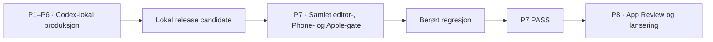

# Arbeidsbeskrivelse fra aktiv Port 1 til App Store

Status: `OPERATIVE_COMPANION_TO_PRODUCTION_PLAN`

Dato for utgangspunkt: 24. juli 2026

Dette registeret gjør den autoritative rekkefølgen i
[`PRODUCTION_PLAN.md`](./PRODUCTION_PLAN.md) om til konkrete arbeidspakker.
Det beskriver hva Codex skal produsere, hva arbeidet avhenger av, hvilket bevis
som lukker pakken, og når editor-in-chief må ta en beslutning. Ved konflikt
gjelder prosjektgrunnloven, godkjente kapittelkontrakter og
`PRODUCTION_PLAN.md`.

Fremdrift føres bare i [`IMPLEMENTATION_STATUS.md`](./IMPLEMENTATION_STATUS.md).
Dette registeret skal ikke brukes til å oppgradere en leveranse fra fixture,
simulatorbevis eller komposisjonsmål til ferdig scene.

Arbeidsrekkefølgen skiller mellom `LOCAL_COMPLETE` og release-`PASS`. Codex
fullfører alt trygt lokalt, offline og simulatorisk arbeid før brukeren
involveres. Redaktørvalg, fysisk iPhone og Apple-konto/tjenestespike er samlet i
Port 7. De forblir obligatoriske; de er ikke løpende avhengigheter for å lage
ikke-shipping kandidater, ferdige beslutningsobjekter eller neste lokale
arbeidspakke.

## 1. Faktisk startpunkt

Følgende er ferdig og kan bygges videre på:

- Phase 0 er godkjent: 24 kapittelkontrakter, 55 buer, 290 kildemovements,
  99 prinsipale nativeinteraksjoner, 48 verdensspor, 106 bueeffekter og 152
  senere aktiveringer.
- Swift-grunnmuren har deterministiske reducere og en grammatikk-nøytral driver
  for alle fem grammatikker, world replay, write-ahead-lagring,
  pakkesignering og streng pakkeverifikasjon.
- Metal-compositor, AVAudioEngine/Core Haptics-transport, StoreKit-rettighet,
  Apple-hostet pakkematerialisering og CloudKit/APNs release discovery har
  native implementasjoner med lokale tester. Ingen av Apple-tjenestene er
  prøvd mot prosjektets virkelige kontoobjekter.
- Node- og SwiftPM-suitene består. `IMPLEMENTATION_STATUS.md` fører den eksakte
  simulatorstatusen; et komponentpass er ikke et fullstendig lokalt gatepass.
- Fem laboratoriescener er valgt. Harvest har kontraktfixture, frame planner,
  `Allocate`-binding, restaureringsmodell og godkjent komposisjonsmål.

Følgende er fortsatt null ved startpunktet:

- godkjente native shippingassets;
- filer i `content/public/`;
- komplette spillbare scener;
- godkjent stemme, narrasjonsmastere og kunstnerisk ferdig score/soundscape;
- komplette nativekapitler og installasjonspakker;
- fysisk iPhone-bevis;
- live StoreKit-produkt, Apple-hostede pakker, CloudKit-container og APNs-runde.

Harvest-fixturen beskriver foreløpig 86 fremtidige filer: 12 scenelag, 27
masker, 45 tilstandsbilder og to Reduce Motion-plater. Ingen av disse filene er
produsert. Referansemasteren er `862 × 1824`; den er godkjent som komposisjons-
og anatomimål, ikke som shippingbilde eller grunnlag for oppskalering. Ingen
fysisk iPhone er koblet til utviklingsmiljøet ved dette startpunktet.

Den aktive kritiske linjen er å fullføre én kostnadsfri produksjonsscene lokalt,
gjøre metoden repeterbar gjennom alle fem interaksjonsgrammatikkene og bygge
videre uten å vente på telefon eller redaktør så lenge arbeidet kan holdes
eksplisitt ikke-shipping.

Arbeidsmengden består av tre verk som må møtes i samme build:

- 722 minutter redigert, faktaverifisert og dramatisert historisk fortelling;
- en native 2.5D-, interaksjons-, lyd-, haptikk- og restaureringsruntime;
- en offline kjøps-, pakke-, oppdaterings- og releaseplattform.

Ingen av dem er støttearbeid for de andre. Et ferdig manus uten runtime er ikke
et kapittel; en sterk motor uten 24 ferdige kapitler er ikke produktet; en
komplett opplevelse uten sikker levering og restaurering kan ikke lanseres.

## 2. Leveransehierarkiet

Kolonnen `Ferdig når` beskriver lokal lukking med mindre raden er merket
`SLUTTGATE`. Lokal lukking kan åpne neste lokale arbeidspakke, men gir aldri
porten `PASS`. En endring i Port 7 gjenåpner alle berørte lokale leveranser.

## 3. Port 1 — produksjonskapasiteten

| ID | Arbeid | Avhengighet | Ferdig når |
|---|---|---|---|
| P1.01 | Lukk innholdskontraktene for alle fem visuelle bindingsformer, stabile string-ID-er, BCP-47-locale, manus-ID/teksthash for narrasjon, appskall/prolog, levende-world-presentasjon og versjonerte save-migreringer. Samle dagens tre ulike haptikkinndelinger i ett offentlig og ett runtime-kompatibelt vokabular. | Godkjent Phase 0 | Swift-, JSON- og Node-kontraktene round-tripper, og negative tester avviser drift. |
| P1.02 | Bygg en blueprint-projeksjonsgate som binder offentlig kapittelpayload til godkjent tese, buer, interaction-ID-er, grammatikker og `WorldEffect`-er. | P1.01 | En endring i et låst redaksjonelt eller kausalt felt stopper kompilering. |
| P1.03 | Bygg en utviklingskompilator for ikke-shipping vertikalsnitt. Den må bruke egen package-ID og en nøkkel som aldri kan godtas av releasebygget. | P1.01–02 | Et lokalt vertikalsnitt kan pakkes og verifiseres; launch-ID-er og produksjonsnøkler avvises. |
| P1.04 | Rekonstruer Harvest som en ny produksjonsmaster på minst `1290 × 2796`, med minst 16 prosent ferdig overscan. Bevar anbefalt kandidat og sterke alternativer som ett beslutningsobjekt. | Godkjent komposisjonsmål | Codex' anbefalte master består historisk, anatomisk, material- og teknisk inspeksjon og er bytebundet som `PROVISIONAL_NON_SHIPPING`; endelig pixelgodkjenning ligger i P7. |
| P1.05 | Produser clean plate, registrerte dybdelag, objekttilstander, alfa-, dybde-, lys-, atmosfære- og okklusjonsmasker samt egen Reduce Motion-komposisjon. Dagens fixture tilsier 86 sluttfiler; endelig filinventar bindes til den godkjente scenen. | P1.04 | Alle filer passer samme masterkoordinater, tåler full kamerabane og har ingen anatomiske, historiske eller tekniske feil. Re-komposisjon matcher masteren, og pikslene utenfor en autorisert lokal endringsmaske forblir identiske. |
| P1.06 | Frys den kostnadsfrie visuelle kjeden og utvid proveniensmodellen til en komplett asset-DAG: verktøy, modell og vekthash, versjon, lisens, prompt/symbolsk kilde, seed, parent-hasher, transformasjoner, avviste feil, slutt-hasher og backupstatus. | P1.04–05 | Proveniensregisteret kan forklare hvert foreløpig asset uten ny kostnad. Eksakte kandidatbytes er bevart; alle deterministiske derivater kan bygges på nytt med samme hash. |
| P1.07 | Lås Codex' anbefalte Harvest-beat, reelle fordelingsrom, countertekst og manus-/cue-splitt. Produser deretter seks anonyme engelske stemmekandidater og én sømløs 18–22 minutters stresstestmaster for hver av de to sterkeste. Masteren kan settes deterministisk sammen av korte, fullt reviderte ytringer ved forfatterbestemte semantiske grenser. Alle ytringer må passere før sammenstilling; tekstpartisjonen forblir eksakt; hørbare skjøter, tale-tidsstrekking og stillhet satt inn bare for å fylle varighet er forbudt. | Verifisert avgrenset Harvest-manus | Kandidatene bygger på samme bytebundne tekst og har ingen ordfeil, feiluttaler, metalliske brudd, hørbare skjøter eller repeterende syntetisk kadens; naturlige tegnsettingspust og forfatterbestemte pauser bevares; manus- og interaksjonsvalget ligger klart for P7. |
| P1.08 | Ranger og frys en foreløpig stemmeidentitet, uttaleleksikon, modell, innstillinger og masterformat for lokal integrasjon. | P1.07 | Valget kan reproduseres lokalt med klarerte kommersielle rettigheter, og et komplett sekskandidat-/tofinalistobjekt er klart for endelig redaktørvalg i P7. |
| P1.09 | Bevis redigerbar score-, soundscape- og haptikkproduksjon. Score skal finnes som noter/tidslinje og stems; haptikk bruker det semantiske settet. Utvid proveniensskjemaet slik at egengenerert, CC0- og eventuelt Apple-lisensiert lyd kan beskrives sannferdig før noen slik fil brukes. | Kostnads- og lisensgate | Harvest har ferdig narrasjon, score, soundscape, stillhet og haptikk i én godkjent tidslinje, og hver lydkilde har dokumentert redistribusjonsrett. |
| P1.10 | Bygg en grammatikk-nøytral scene driver, Metal-compositor, direkte touch/VoiceOver-input og runtimeadapter for `Allocate`. | P1.01, P1.05 | Harvest virker som en scene og ikke som en fixture eller et kontrollpanel. |
| P1.11 | Bygg `AVAudioEngine`-avspilling, lydrutehåndtering, Core Haptics og samplebundet lagring. | P1.08–09 | Kontrollert pause er sample-eksakt; hard kill holder seg innen 250 ms og kald retur åpner pauset. |
| P1.12 | Aktiver scenen fra en signert lokal pakke og bevis atomisk installasjon, hashkontroll, rollback og offlinebruk. | P1.03, P1.05–11 | Manglende, endret eller korrupt asset avvises uten å skade siste verifiserte installasjon eller save. |
| P1.13 | Lås fysisk enhetsprotokoll for modell/iOS, 30-minutters batterimåling, termikk, minne, frame time og lagringspress uten å kreve telefonen. | Numeriske releasebudsjetter | Protokollen kan gjentas med samme startbetingelser; fysisk utførelse ligger i P7. |
| P1.14 | Fullfør StoreKit-, Background Assets-, CloudKit/APNs- og varslingsadaptere, identifikatorkontrakter, caches og full lokal feilmatrise. | P1.01–03, P1.12 | Alle ikke-nettverksavhengige tilstander består; eksakte kontoobjekter og brukerhandlinger er samlet for P7. |
| P1.15 · SLUTTGATE | Kjør ekte Apple-tjenestespike og komplett Harvest-port på fysisk iPhone. | P1.01–14 `LOCAL_COMPLETE`, editorvalg og Apple-konto | Signert StoreKit/pakke/CloudKit/APNs-runde og Harvests tilgjengelighet, restaurering, offlinebruk, ytelse, lyd og rettigheter har `PASS`; editor-in-chief godkjenner scenen. |

Port 1 bærer størst usikkerhet. Hvis bilde- eller lydkjeden ikke når nivået uten
betaling, dokumenterer Codex forsøkte ruter og fortsetter andre trygge lokale
linjer. Saken legges først frem når den faktisk sperrer videre arbeid. Kravet
senkes ikke.

## 4. Port 2 — fem komplette laboratoriescener

| ID | Arbeid | Avhengighet | Ferdig når |
|---|---|---|---|
| P2.01 | Implementer full visuell binding og sceneadapter for `Trace`. | P1.10 | En signert fixture og scenetest driver rute, motstand, respons og varig effekt uten særkode i viewet. |
| P2.02 | Implementer tilsvarende for `Assemble`. | P1.10 | Deler, gyldige forbindelser, lokal feil og ferdig institusjon/struktur drives av domenestate. |
| P2.03 | Implementer tilsvarende for `Pressure`. | P1.10 | Krefter, terskler, avlastning og brudd vises i verdenen og restaureres deterministisk. |
| P2.04 | Implementer tilsvarende for `Transform`. | P1.10 | Samme sted eller system går gjennom kausale ledd og etterlater irreversibel state. |
| P2.05 | Produser de fire resterende visuelle scenepakkene med samme master-, lag-, maske- og proveniensstandard som Harvest. | P1 `LOCAL_COMPLETE`, P2.01–04 | Hver scene har et separat bytebundet godkjenningsobjekt og ingen svakere produksjonsmetode. |
| P2.06 | Skriv, verifiser og frys Codex' anbefalte baseline for de fem avgrensede beatmanusene; produser komplett foreløpig lyd og tilgjengelighet for hver scene. | P1.08–09 | Lesetekst, narrasjon og VoiceOver bygger på samme bytebundne manus; alle F1–F7-saker er lukket backstage. |
| P2.07 | Kjør interaksjonsporten for hver scene: første respons under 50 ms, mål minst 44 pt, ingen tutorial-overlay, samme slutthash med standardinput og VoiceOver. | P2.01–06 | Alle fem individuelle rapporter har `PASS`. |
| P2.08 | Kjør samlet lokal kunstnerisk inspeksjon, simulatorport og reproduksjonsbevis. | P2.07 | Det svakeste av de fem lokale bevisene holder samme nivå som det sterkeste, produksjonskjeden kan gjentas fra Codex og hele settet er klart for fysisk/editor-gate i P7. |

## 5. Port 3 — spillbar prolog og hele `The First Farmers`

| ID | Arbeid | Avhengighet | Ferdig når |
|---|---|---|---|
| P3.01 | Lag kanonisk offentlig source tree for prologen og Chapter 01 med stabile ID-er, manus, beats, sceneplaner, seks prinsipale interaksjoner, world seed/effects, lyd og tilgjengelighet. | Port 2 `LOCAL_COMPLETE`, P1.01–03 | Kildene validerer mot blueprinten og inneholder ingen backstage-felt. |
| P3.02 | Bygg content repository og chapter coordinator som laster validert innhold i stedet for hardkodede SwiftUI-noder. | P3.01 | Appen kan starte bue, gå mellom beats, drive interaksjon, lagre og fullføre kapittel fra payload. |
| P3.03 | Bygg den komplette spillbare prologen og overgangen til den levende verdenen og Chapter 01. | P3.02 | Kald installasjon leder til første historiske handling uten konto, kjøp eller varslingsprompt. |
| P3.04 | Skriv og frys anbefalt baseline for de tre buene i Chapter 01; kjør F1–F7-verifikasjon og redaksjonell regresjon. | Godkjent kapittelkontrakt | Alle funn er lukket backstage, og eksakt offentlig tekst er samlet som redaktørobjekt for P7. |
| P3.05 | Produser alle scener, overganger, interaksjoner, stillhetsbeats, mastere, lag og tilstander for kapitlet. | P3.04 | Hele kapitlet har ferdig 2.5D-regi; ingen webside med effekter eller midlertidig asset står igjen. |
| P3.06 | Produser komplett narrasjon, score, soundscape, stillhet, haptikk og tilgjengelighet. | P3.04–05 | Alle cues er manusbundet, uttaler er lukket, og tilgjengelighetsvariantene gir samme konsekvens. |
| P3.07 | Bygg og signer den ikke-shipping vertikalsnittpakken. | P3.01–06 | Prolog og Chapter 01 installeres, spilles, drepes og gjenopptas fullstendig i flymodus. |
| P3.08 | Kjør simulatorprofilering, full lokal feilinjeksjon og datert benchmark mot faktiske konkurrentversjoner. | P3.07 | Ingen lokal vertikalsnittkontroll feiler og ingen lokalt målbar benchmarkdimensjon har `DEFICIT` eller `NOT TESTED`; fysisk budsjett står uttrykkelig åpent til P7. |
| P3.09 | Mål produksjonshastighet og revisjonsvolum. | P3.04–08 | Faktiske timer, genereringer, assetvolum, byggetid og tilbakeføringer gir grunnlag for første troverdige kalender. |
| P3.10 · SLUTTGATE | Editorens vertikalsnitt- og enhetsport. | P3.08–09, P7-kandidat | Editor-in-chief godkjenner hele opplevelsen på fysisk iPhone; berørte endringer er regresjonstestet. |

## 6. Port 4 — produktskall og gratistriad

| ID | Arbeid | Avhengighet | Ferdig når |
|---|---|---|---|
| P4.01 | Generer en komplett `collection` for alle 24 kapitler, åtte pakker, tre gratis ID-er og én permanent tilgangsregel. | P1.01–03 | Manifestet matcher den godkjente leveranseplanen og kan ikke drive fra den. |
| P4.02 | Bygg den levende verdenen som hjem- og returflate med 24 ruter, faktiske verdensspor, senere aktiveringer og nåværende kausale punkt. | P3.02, P4.01 | Flaten leser world state; den er ikke en statisk kurve eller et kortbibliotek. |
| P4.03 | Bygg per-kapittel sessions, completed beats/arcs, wall-clock-fravær og valgfri reorientering. | P4.02 | Åpning av en ny vei overskriver ikke en annen økt, og retur går til samme kausale punkt. |
| P4.04 | Produser hele `The Frontiers Hold`: to buer, 14 movements og fire prinsipale interaksjoner. | Port 3 `LOCAL_COMPLETE` | Komplett lokal kapittelport og bytebundet sluttgateobjekt. |
| P4.05 | Produser hele `The European World`: to buer, 14 movements og fire prinsipale interaksjoner. | Port 3 `LOCAL_COMPLETE` | Komplett lokal kapittelport og bytebundet sluttgateobjekt. |
| P4.06 | Tilbakefør alle forbedringer fra Chapters 13 og 21 til Chapter 01. | P4.04–05 | Ny full regresjonsrunde viser samme kvalitetsgulv i alle tre gratis kapitler. |
| P4.07 | Integrer StoreKit 2 entitlement store, transaction listener, offline cache og access resolver i produktskallet. | P1.14, P4.01 | Purchase, cancel, pending, restore, refund, revocation og reinstallasjon består lokalt; testprodukt og Apple-ID/storefront-skifte kjøres i P7. |
| P4.08 | Bygg låst vei og kjøpsflate. | P4.02, P4.07 | Betalingsflaten finnes bare etter at brukeren velger en låst vei; ett kjøp åpner hele samlingen. |
| P4.09 | Bygg Background Assets-klient, staging, installed-package index, atomisk aktivering, pause/resume, rollback og `Download all`. | P1.12, P1.14 | Nettutfall, full disk, prosessdød, appoppdatering og korrupt pakke mister aldri siste verifiserte installasjon eller save. |
| P4.10 | Bygg innstillinger for narrasjon, lyd, tilgjengelighet, lagring og nedlastinger. | P4.02–09 | Innstillingene virker offline og bryter ikke den historiske returflaten. |
| P4.11 | Kompiler den faktiske `essential-free-v1`-pakken. | P4.04–06, P4.09 | Prolog/appskall og tre gratis kapitler installeres korrekt, pakken er høyst 750 MB og full flymodusrunde består. |
| P4.12 | Kjør gratistriadens samlede lokale port. | P4.01–11 | Alle tre perioder holder samme foreløpige kunstneriske og tekniske nivå; StoreKit og levering består lokale feilmatriser og er klare for reelle Apple-testtjenester i P7. |

## 7. Port 5 — 21 betalte kapitler

Produksjonen skjer i fire bølger. Work in progress er begrenset til ett kapittel
i hver av tre linjer: manus/verifikasjon, visuell og auditiv produksjon, og
integrasjon/QA.

| Bølge | Kapitler | Buer | Minutter | Movements | Prinsipale interaksjoner | Utgang |
|---|---:|---:|---:|---:|---:|---|
| P5.A | 02–06 | 13 | 156 | 55 | 20 | Fem komplette kapitler; svakeste mot sterkeste; alle felles forbedringer tilbakeført. |
| P5.B | 07–12 | 15 | 191 | 74 | 25 | Seks komplette kapitler og ny bølgeregresjon. |
| P5.C | 14–20 | 14 | 200 | 88 | 28 | Sju komplette kapitler og ny bølgeregresjon. |
| P5.D | 22–24 | 6 | 87 | 38 | 12 | Tre komplette kapitler; Chapter 24 bundet til fersk primærkildeverifikasjon under faktalåsen. |

Hvert av de 21 kapitlene må gjennom samme arbeidsenhet:

1. projiser godkjent kontrakt til buer, beats, scener, interaksjoner og effects;
2. skriv offentlig manus og lukk F1–F7-verifikasjon backstage;
3. kjør redaksjonell regresjon og frys Codex' anbefalte tekstbaseline som et
   bytebundet redaktørobjekt;
4. lag anbefalt visuell hovedretning og bevar relevante alternativer for P7;
5. produser mastere, clean plates, lag, masker, tilstander og atmosfære;
6. bygg de prinsipale interaksjonene som handlinger i den historiske verdenen;
7. spill en komplett grovversjon, juster rytme og frys foreløpig tekstlås;
8. produser komplett foreløpig narrasjon, scorestems, soundscape, stillhet og
   haptikk;
9. produser VoiceOver, Dynamic Type, Increased Contrast og Reduce Motion;
10. frys hasher, proveniens og separate godkjenningsobjekter;
11. bygg signert lokal pakke og kjør flymodus, avbrudd og restaurering;
12. tvangsavslutt ved hvert beat og fem punkter i hver hovedinteraksjon;
13. mål alt simulatoren kan bevise; legg termikk, batteri og fysisk ytelse i
    P7-køen;
14. sammenlign med sterkeste ferdige kapittel og relevante benchmarkverk;
15. legg hele kapitlet i den samlede, bytebundne editor- og telefonkøen for P7.

En lokal bølge går ikke videre med kjente midlertidige assets, åpne faktasaker,
uklar lisens, uferdig lyd, manglende tilgjengelighetsvariant eller utestet
pakke. `PROVISIONAL_NON_SHIPPING` beskriver godkjenningsstatus, ikke tillatelse
til lavere produksjonsfinish.

## 8. Port 6 — samlet verk og fremtidig innhold

| ID | Arbeid | Avhengighet | Ferdig når |
|---|---|---|---|
| P6.01 | Spill alle handoffs, verdensspor og senere aktiveringer i samlingsrekkefølge og fra alle tillatte alternative innganger. | Port 5 `LOCAL_COMPLETE` | Samme fullførte historie gir identisk world state og SHA-256 i to fullstendige replay. |
| P6.02 | Frys offentlig inventar og payload for basispakken og sju betalte pakker. | P6.01 | Alle åtte pakkeinventarer er bytebundet som ferdige sluttgateobjekter. |
| P6.03 | Opprett produksjonsnøkkel utenfor repo, pin offentlig nøkkel i appen og bygg lokalkandidater i utviklingens separate tillitsdomene. | P6.02 | Feil nøkkel, key-ID, signatur eller digest avvises før decode og aktivering; endelig produksjonssignering venter på P7-godkjenning. |
| P6.04 | Kjør kjøp, restore, nedlasting, oppdatering og rollback mot de eksakte lokale releasekandidatene. | P6.03 | Sist verifiserte installasjon og progresjon overlever den lokale feilmatrisen; ekte tjenester gjenstår eksplisitt til P7. |
| P6.05 | Integrer CloudKit release catalog, `CKQuerySubscription`, APNs-ruting, deduplisering og deep link til riktig sted i verdenen. | P1.14, P4.02, P4.09 | Cache/offline, filtering og deduplisering består lokalt; reell container og APNs kjøres i P7. |
| P6.06 | Bygg én upublisert dypdykkpakke med egen ID, approval, provenance og release record. | P6.05 | Den fester seg til riktig tid/sted, leser tidligere state, installeres uten ny runtimekode og virker fullstendig offline. |
| P6.07 | Kjør bytebudsjettene. | P6.02–06 | App/motor er høyst 100 MB, gratispakken høyst 750 MB, hver betalt pakke høyst 750 MB og total installasjon høyst 6 GB. |
| P6.08 | Kjør den lokale content-complete-porten. | P6.01–07 | 24 kapitler, 55 buer og 99 interaksjoner er `LOCAL_COMPLETE`; ingen lokalt målbar kjernebenchmark har `DEFICIT` eller `NOT TESTED`, og alle redaktør-/enhets-/servicepunkter er samlet for P7. |

## 9. Port 7 — release candidate

| ID | Arbeid | Ferdig når |
|---|---|---|
| P7.00 | Legg frem de samlede, ferdige beslutningsobjektene: stemme, Harvest/laboratoriesett, prolog, 24 manus og hovedretninger, integrerte kapitler og pakkeinventarer. Anvend valgene og kjør all berørt regresjon. | Editor-in-chief har tatt bare de nødvendige beslutningene; ingen foreløpig baseline er ommerket til godkjent uten ny produksjon. |
| P7.01 | Frys ett appbygg og åtte eksakte pakkehasher etter P7.00. | Alle senere tester bruker de samme bytefilene. |
| P7.02 | Kjør full funksjons-, feil-, offline-, save-, StoreKit-, levering-, lyd- og tilgjengelighetsmatrise. | Ingen testlinje står som `NOT TESTED`; alle resultat har `PASS`. |
| P7.03 | Spill og mål alle 24 kapitler på den registrerte fysiske testtelefonen. | 60 fps-mål, p99 under 25 ms, minne under 500 MB, respons under 50 ms, startbudsjetter, batteri og termikk består. |
| P7.04 | Kjør kunstnerisk nulliste og offentlig-pakke-skann. | Null åpne anakronismer, anatomifeil, laghalos, lydfeil, feiluttaler, backstage-data eller akademisk lekkasje. |
| P7.05 | Oppdater datert benchmark med faktisk RC-bevis. | Ingen kjerne-`DEFICIT`; det svakeste kapitlet tåler sammenligning. |
| P7.06 | Fastsett pris og produser ikon, screenshots, App Preview, metadata, personvern, IAP-presentasjon og review-notater. | Alle materialer viser det faktiske verket og er versjonsbundet til RC. |
| P7.07 | Flytt CloudKit-skjema og roller til production, bind APNs og bygg produksjonssignert arkiv. | Container, entitlements, releasekatalog, versjon og arkiv samsvarer med RC. |
| P7.08 | Fullfør Apple-kontokrav som Codex ikke kan utføre på brukerens vegne. | Paid Apps-avtale, bank/skatt, aldersgrense, kryptering, Privacy Manifest, territorier og IAP står klare. |
| P7.09 | Editorens RC-port. | Editor-in-chief godkjenner de eksakte offentlige bytefilene og App Store-presentasjonen. |

## 10. Port 8 — App Review og lansering

| ID | Arbeid | Ferdig når |
|---|---|---|
| P8.01 | Send app, permanent IAP og sju Apple-hostede pakker til App Review. | Alle objektene ligger i samme godkjente versjonssammenheng. |
| P8.02 | Lukk konkrete tekniske eller policyrelaterte reviewfunn. | Godkjent Apple-bygg og pakker er identiske med eller eksplisitt re-godkjent som ny RC. |
| P8.03 | Installer den Apple-prosesserte binæren og kjør kjøp, restore, `Download all`, alle åtte payloads, CloudKit/APNs og flymodus på testtelefonen. | Hele produksjonssmoken består mot App Store-miljøet. |
| P8.04 | Kontroller storefront, pris, IAP, personvern, hasher og produksjonskonfigurasjon. | Ingen forskjell fra den godkjente releasepakken. |
| P8.05 | Editor-in-chief gir eksplisitt publiseringsgodkjenning. | Appen kan publiseres manuelt. |
| P8.06 | Overvåk første drift med MetricKit og App Store Connect. | Crash, datatap, kjøp, nedlasting og restaurering har en dokumentert responsrutine. |

Apple bestemmer featured-status. Vårt arbeid slutter ikke ved en godkjent build;
det slutter når det samme verket som besto portene er godkjent, produksjonstestet
og publisert uten avvik.

## 11. Arbeid som gjelder alle porter

### Redaksjonell kontroll

- Hver offentlig tekst starter i en godkjent kapittelkontrakt.
- Faktaverifikatoren returnerer bare `PASS`, `NARROW`, `REPLACE`, `REMOVE` eller
  `EDITOR_DECISION` med F1–F7.
- Verifikatoren skriver aldri offentlig tekst.
- Endring av tese, kausal ryggrad, vekt, standpunkt eller avslutning går til
  editor-in-chief.
- Offentlig pakke kan ikke inneholde kilder, confidence-data, metodikk,
  historiografi eller en konkurrerende fortellerstemme.

### Asset- og rettighetskontroll

- Hvert synlig og hørbart asset får kilde/modell, versjon, lisens,
  transformasjonshistorikk og slutt-hash.
- Uklar kommersiell rett, betalingskrav, automatisk overforbruk eller
  ikke-kommersiell lisens avviser assetet.
- En godkjent master sikkerhetskopieres kryptert og hash-verifiseres før
  destruktiv bearbeiding.
- En komposisjonsgodkjenning godkjenner ikke shippingpixler, og en assetapproval
  godkjenner ikke kapitlet eller pakken.

### Kvalitetsratchet

- En forbedring i renderer, typografi, lyd, haptikk, tilgjengelighet,
  restaurering eller pakking markerer alle berørte tidligere kapitler for ny
  regresjon.
- Det svakeste obligatoriske kapitlet bestemmer releaseberedskap.
- Polering kan ikke samles i prologen, Chapter 01 eller gratistriaden.

### Codex-only produksjon

- Codex holder alle autoritative kilder, data, prompts, assets, tester og
  rapporter i versjonerbare filer.
- Brukeren skal ikke måtte arbeide i Xcode, Unity, Unreal, Figma, et CMS eller
  en lydeditor.
- Ingen ekstern forteller, komponist, kunstner, historiker, tester eller annen
  menneskelig bidragsyter inngår før brukeren uttrykkelig endrer regelen.

## 12. Beslutninger som krever editor-in-chief

Codex gjennomfører resten av arbeidet og legger frem ferdige
godkjenningsobjekter samlet i P7 så langt en tidligere beslutning ikke er den
eneste muligheten til å åpne mer lokalt arbeid. Disse beslutningene forblir hos
brukeren:

1. endelig fortellerstemme;
2. Harvest-shippingmaster og samlet laboratoriesett;
3. hele prologen og `The First Farmers` på fysisk iPhone;
4. offentlig manusbaseline og hovedretning for hvert kapittel;
5. ethvert `EDITOR_DECISION` som kan endre den låste fortellingen;
6. samlet go/no-go for gratistriaden og produksjonsbølgene;
7. engangspris;
8. ikon, App Store-materiale, release candidate og eksakte offentlige bytefiler;
9. nødvendige handlinger i Apple-kontoen og endelig publisering;
10. en eventuell eksplisitt endring av nullkost, ingen-mennesker eller
    kvalitetskravet dersom en dokumentert produksjonskjede mislykkes.

## 13. Første utførbare kø

Dette er rekkefølgen fra dagens repo. Punktene kan gå parallelt der
avhengighetene tillater det.

1. hold den komplette lokale testgaten grønn mens delte runtimekontrakter
   utvikles;
2. produser og ranger fulloppløselige Harvest-masterkandidater, uten å hevde
   shippinggodkjenning;
3. produser Harvest-lag, masker, tilstander og Reduce Motion-underlag;
4. produser seks stemmekandidater, velg to foreløpige finalister og lag to
   sømløse stresstestmastere etter P1.07-kontrakten;
5. integrer Harvest fra signert lokal pakke med bilde, lyd, haptikk,
   tilgjengelighet og eksakt restaurering;
6. fullfør produksjonsadapterne og de fire øvrige laboratoriescenene;
7. bygg prologen og hele Chapter 01 etter Port 2 `LOCAL_COMPLETE`;
8. bygg produktskallet og gratistriaden lokalt;
9. fortsett gjennom resterende kapitler, samlet verden, pakker og dypdykkbevis
   så langt alle leveranser kan holdes ikke-shipping;
10. bygg én lokal release candidate og samle alle ferdige beslutningsobjekter;
11. involver først da editor-in-chief, den fysiske iPhonen og Apple-kontoen i
    P7;
12. anvend valgene, kjør berørt regresjon og frys den faktiske RC-en.

## 14. Kalender og kapasitet

Det settes ingen lanseringsdato nå. De største ukjente størrelsene er antall
visuelle revisjoner per scene, lokal genereringshastighet, lydrevisjoner og
integrasjonstid per ferdig bue. Chapter 01 måler alle fire i et helt kapittel.
Etter lokal Port 3 kan Codex lage en intern kalender basert på faktisk gjennomstrømning og
føre prognose per bølge. Før det ville datoen være en gjetning som kunne skape
press mot kvalitetsportene.

Målingen etter Chapter 01 skal minst inneholde lokalt ferdige minutter per
manusrevisjon, masterscener per movement, lag/masker/varianter per scene,
genererings- og korreksjonsrunder per master, lydcues og uttalekorreksjoner per
minutt, feil per grammatikk, estimert og senere faktisk fysisk QA-tid per beat og cue, MB per minutt og
assetklasse, byggetid, editorbeslutninger og tilbakeføringsfaktor. Kalenderen
styres av den tregeste aktive linjen, ikke av et gjennomsnitt av de tre.
