# Arbeidsbeskrivelse fra aktiv Port 1 til App Store

Status: `FROZEN_HISTORICAL`

Dette iPhone-registeret ble fryst 5. august 2026. Arbeidspakkene nedenfor er ikke aktive og skal ikke
brukes som plan, arkitektur eller produksjonskrav for den nye Mac-utforskningen.

Dato for utgangspunkt: 24. juli 2026

Dette registeret gjør den autoritative rekkefølgen i
[`PRODUCTION_PLAN.md`](./PRODUCTION_PLAN.md) om til konkrete arbeidspakker.
Det beskriver hva Codex skal produsere, hva arbeidet avhenger av, hvilket bevis
som lukker pakken, og når editor-in-chief må ta en beslutning. Ved konflikt
gjelder prosjektgrunnloven, godkjente kapittelkontrakter og
`PRODUCTION_PLAN.md`.

## Medium lock 30. juli 2026

Editor-in-chief har låst regissert sanntids-3D for hele Journey; se
[`blueprint/real-time-3d-medium-lock-2026-07-30.md`](./blueprint/real-time-3d-medium-lock-2026-07-30.md).
De aktive arbeidspakkene er rebased til Chapter 01s sanntids-3D-bevis. Clean
plates, dybdelag, masker og tilstandsbilder fra den erstattede veien finnes bare
i git-historikk og eksplisitt merket prototypeevidens. De øvrige portene gjelder
fortsatt.

[`bibles/experience-bible.md`](./bibles/experience-bible.md) styrer dette
beviset. Ingen erstatningspakke kan hoppe over opplevelsespakke,
silent-greybox, first-use/full-run-måling eller klassifisering av læring som
`SHARED`, `CHAPTER_SPECIFIC` eller `UNPROVEN`.

Fremdrift føres bare i [`IMPLEMENTATION_STATUS.md`](./IMPLEMENTATION_STATUS.md).
Dette registeret skal ikke brukes til å oppgradere en leveranse fra fixture,
simulatorbevis eller komposisjonsmål til ferdig scene.

Arbeidsrekkefølgen skiller mellom `LOCAL_COMPLETE` og release-`PASS`. Codex
fullfører alt trygt lokalt, offline og simulatorisk arbeid før hver nødvendig
brukerport. Editor-in-chief godkjente Chapter 01s nye opplevelsesprojeksjon 30.
juli 2026; P1.00 har derfor supersedert den gamle bueprojeksjonen og åpnet
3D-løpet. Før release candidate brukes editor og fysisk iPhone bare ved to
meningsfulle Chapter 01-porter: den komplette `0:00–2:30`-slicen før
resterende sluttkunst og den komplette kapittelkandidaten. Femsekundersprøver
og interne kunstiterasjoner er Codex-/simulatorarbeid. Apple-konto,
tjenestespike og den endelige RC-runden samles i Port 7.

## 1. Faktisk startpunkt

Følgende er ferdig og kan bygges videre på:

- Phase 0 er godkjent med en pre-P1.00-baseline på 24 kapittelkontrakter, 55
  buer og 290 kildemovements,
  99 prinsipale nativeinteraksjoner, 48 verdensspor, 106 bueeffekter og 152
  senere aktiveringer.
- Swift-grunnmuren har deterministiske reducere og en grammatikk-nøytral driver
  for alle fem grammatikker, world replay, write-ahead-lagring,
  pakkesignering og streng pakkeverifikasjon.
- Metal-compositor, AVAudioEngine/Core Haptics-transport, StoreKit-rettighet,
  Apple-hostet pakkematerialisering og CloudKit/APNs release discovery har
  native implementasjoner med lokale tester. Ingen av Apple-tjenestene er
  prøvd mot prosjektets virkelige kontoobjekter.
- Node- og SwiftPM-suitene består. `IMPLEMENTATION_STATUS.md` fører den eksakte
  simulatorstatusen; et komponentpass er ikke et fullstendig lokalt gatepass.
- Det tidligere femsceners laboratoriet har kontraktfixtures, frame planner,
  grammatikkbindinger, restaureringsmodell og komposisjonsmål. Alt er
  prototypeevidens; ingen av scenene er en aktiv visuell produksjonspakke.

Følgende er fortsatt null ved startpunktet:

- godkjente native shippingassets;
- filer i `content/public/`;
- komplette spillbare scener;
- godkjent stemme, narrasjonsmastere og kunstnerisk ferdig score/soundscape;
- komplette nativekapitler og installasjonspakker;
- fysisk iPhone-bevis;
- live StoreKit-produkt, Apple-hostede pakker, CloudKit-container og APNs-runde.

Den gamle Harvest-fixturen beskriver et pensjonert 86-filers lag- og
maskeinventar. Referansemasteren på `862 × 1824` er kun komposisjons- og
anatomireferanse for den nye thessaliske 3D-cellen; ingen pixel, estimert dybde
eller filslot kan bli produksjonsstate. Ingen fysisk iPhone er koblet til
utviklingsmiljøet ved dette startpunktet.

Den aktive kritiske linjen fra den editor-godkjente Chapter 01-projeksjonen er
`RealityKit-/kunstmetodebevis → komplett greybox → komplett 0:00–2:30
produksjonsslice → resterende kapittelblokker → helt kapittel`. Metodebeviset
kan vise inntil fem sekunder, men er ikke sluttkunst og kan ikke hindre at
greyboxen fullføres. Ingen visuell produksjon starter fra den pensjonerte
2.5D-ruten.

Arbeidsmengden består av tre verk som må møtes i samme build:

- den historiske pre-P1.00-baselinen på 55 buer og 722 planlagte minutter;
  Chapter 01 styres nå av fem celler og seks sekvenser med en `UNPROVEN`
  tidsplan på 13:35, og ingen ny samlet minuttmengde brukes som ferdigkrav;
- en regissert sanntids-3D-, interaksjons-, lyd-, haptikk- og
  restaureringsruntime;
- en offline kjøps-, pakke-, oppdaterings- og releaseplattform.

Ingen av dem er støttearbeid for de andre. Et ferdig manus uten runtime er ikke
et kapittel; en sterk motor uten 24 ferdige kapitler er ikke produktet; en
komplett opplevelse uten sikker levering og restaurering kan ikke lanseres.

## 2. Leveransehierarkiet

```mermaid
flowchart LR
    A["P1–P2 · metode og komplett greybox"] --> B["S1 · komplett slice, editor + iPhone"]
    B --> C["F1 · komplett Chapter 01, editor + iPhone"]
    C --> D["P4–P6 · Codex-lokal fullproduksjon"]
    D --> E["Lokal release candidate"]
    E --> F["P7 · editor-, iPhone- og Apple-gate"]
    F --> G["Berørt regresjon og P7 PASS"]
    G --> H["P8 · App Review og lansering"]
```

Kolonnen `Ferdig når` beskriver lokal lukking med mindre raden er merket
`SLUTTGATE`. Lokal lukking kan åpne neste lokale arbeidspakke. `S1` og `F1`
krever eksplisitt editor- og enhets-`PASS`, men gir ingen shippingmyndighet. En
endring i en senere gate gjenåpner alle berørte leveranser.

## 3. Port 1 — sanntids-3D-substrat og nullkostkjede

| ID | Arbeid | Avhengighet | Ferdig når |
|---|---|---|---|
| P1.00 · `LOCAL_COMPLETE` | Anvend editorens godkjenning: superseder den gamle Chapter 01-bueprojeksjonen og bind den godkjente opplevelsespakken etter `bibles/experience-bible.md`, med de ti godkjente bygg-cueene ordrette og uten shippinggodkjenning. | Editor-godkjent Chapter 01-opplevelsesprojeksjon | Godkjenningsobjektet bytebinder planen med fem celler, manuset med seks sekvenser og uendrede `contract-01`-/interaction-/`WorldEffect`-invarianter; den gamle tre-bue/17-scene/28-minutters projeksjonen er kun historisk evidens; spillbar premiss, trykkurve, ledger, overgangs-/identitetskart, menneskelig ryggrad, sanseplan, narrasjonsfunksjoner og restaureringsankere er eksplisitte; alle Chapter 01-tider er `UNPROVEN`. |
| P1.01 | Lukk innholdskontraktene for alle fem visuelle bindingsformer, stabile string-ID-er, BCP-47-locale, manus-ID/teksthash for narrasjon, appskall/prolog, levende-world-presentasjon og versjonerte save-migreringer. Samle dagens tre ulike haptikkinndelinger i ett offentlig og ett runtime-kompatibelt vokabular. | Godkjent Phase 0 | Swift-, JSON- og Node-kontraktene round-tripper, og negative tester avviser drift. |
| P1.02 | Bygg en blueprint-projeksjonsgate som binder offentlig kapittelpayload til godkjent tese, gjeldende bue- eller erstatningsprojeksjon, interaction-ID-er, grammatikker og `WorldEffect`-er. | P1.00–01 | En endring i et låst redaksjonelt eller kausalt felt, eller gjeninnføring av supersedert projeksjon, stopper kompilering. |
| P1.03 | Bygg en utviklingskompilator for ikke-shipping vertikalsnitt. Den må bruke egen package-ID og en nøkkel som aldri kan godtas av releasebygget. | P1.01–02 | Et lokalt vertikalsnitt kan pakkes og verifiseres; launch-ID-er og produksjonsnøkler avvises. |
| P1.04 | Bevis RealityKit som eneste aktive runtimehypotese og den kostnadsfrie verktøykjeden mot én enkel Chapter 01-celle. | P1.00 | Cellen har versjonert scenegraph, regissert kamera, deterministisk domenestate og absolutte authored-tick-transformer, direkte touch, VoiceOver, Reduce Motion og målte lokale ytelsesdata. Valget fryses når den komplette 2:30-slicen består fysisk; en egen Metal-motor åpnes ikke uten dokumentert fysisk RealityKit-avvik og ny editorbeslutning. |
| P1.05 | Bygg et kort, ikke-promoterende premium skulpturelt figur-/material-/kontaktbevis ved faktisk portrettavstand. | P1.04 | Menneske, ungdyr, båt, tau, vann og lys viser at metoden har riktig kvalitetsretning. Beviset er et verktøy- og kunsthypotesetest, ikke en ferdig scene eller en port som blokkerer komplett greybox. |
| P1.06 | Frys den kostnadsfrie 3D-kjeden og utvid proveniensmodellen for shippingkandidater: verktøy, modell/vekthash, versjon, lisens, prompt eller symbolsk kilde, vesentlige parent-hasher og transformasjoner samt slutt-hasher. | P1.04; M0-funn brukes når de finnes | Hvert promotert asset kan forklares uten ny kostnad; avviste eksperimenter kan oppsummeres uten å bli permanente DAG-noder, og ingen ugjennomsiktig editorfil er eneste autoritative kilde. |
| P1.07 | Produser én eller to rettighetsklarerte engelske stemmekandidater mot de faktiske Chapter 01-cueene og et representativt langvindu. | Verifisert cue-sett, kostnads- og lisensgate | Minst én kandidat må bestå ord, uttale, rytme, emosjonell kontroll, lange vinduer og lokal reproduksjon. Kandidatantall er ikke et kvalitetsmål. |
| P1.08 | Frys en foreløpig stemmeidentitet, uttaleleksikon, modell, innstillinger og masterformat bare dersom en kandidat faktisk består. | P1.07 | Valget kan reproduseres lokalt med klarerte kommersielle rettigheter. Hvis ingen kandidat består, forblir stemmen en eksplisitt åpen editorblokkering; den ommerkes ikke til godkjent. |
| P1.09 | Bevis redigerbar score-, soundscape- og haptikkproduksjon. Score finnes som noter/tidslinje og stems; hver lyd har en konkret kilde; haptikk bruker det semantiske settet. | Kostnads- og lisensgate | En foreløpig substrattidslinje kan reproduseres med dokumenterte redistribusjonsretter uten å late som Chapter 01s endelige lyd er produsert. |
| P1.10 | Bygg en grammatikk-nøytral 3D-scenedriver med fail-closed binding for `Trace`, `Allocate`, `Assemble`, `Pressure` og `Transform`. | P1.01, P1.04 | Rendereren viser samme aksepterte domenehandling og `WorldEffect` med direkte touch og VoiceOver; view- eller fysikkstate kan ikke forfalske fullføring. |
| P1.11 | Bygg render-clock-basert lydavspilling, lydrutehåndtering, Core Haptics og samplebundet lagring med foreløpige cues. | P1.09 | Kontrollert pause fanger eksakt transportcursor; hard kill gjenåpner pauset fra siste varige cursor. Dagens 250 ms-forsinkelse er en hypotese som måles og fryses i den komplette slicen. Ingen port påstår sampleperfekt fysisk høyttalerutgang. Den endelige stemmen kan fortsatt være åpen. |
| P1.12 | Aktiver 3D-substratet fra en signert lokal pakke og bevis atomisk installasjon, hashkontroll, nettverksnektet bruk og varig checkpoint-restaurering. | P1.03–04, P1.10–11 | Manglende, endret eller korrupt asset avvises uten å skade save. Nedlastede pakker kan rulles tilbake til sist verifiserte installasjon; en korrupt bundlet essential-pakke stopper før decode og krever reinstallasjon/oppdatering i stedet for en falsk rollback. |
| P1.13 | Lås fysisk enhetsprotokoll for modell/iOS, 30-minutters batterimåling, termikk, minne, frame time og lagringspress uten å kreve telefonen. | Numeriske releasebudsjetter | Protokollen kan gjentas med samme startbetingelser. Første kvalifiserende utførelse skjer ved S1; komplett kapittel og RC gjentas ved F1 og P7. |
| P1.14 | Fullfør StoreKit-, Background Assets- og lokale releasekatalogadaptere, identifikatorkontrakter, caches og full lokal feilmatrise. | P1.01–03, P1.12 | Alle ikke-nettverksavhengige tilstander består; eksakte kontoobjekter og brukerhandlinger er samlet for P7. Push/CloudKit-release discovery er ikke launchkritisk. |
| P1.15 · SLUTTGATE | Kjør ekte Apple-tjenestespike og komplett substratport på fysisk iPhone. | P1.00–14 `LOCAL_COMPLETE`, editorvalg og Apple-konto | Signert StoreKit-/pakkerunde og substratets tilgjengelighet, restaurering, offlinebruk, ytelse, lyd og rettigheter har `PASS`. |

Port 1 bærer størst usikkerhet. Hvis bilde- eller lydkjeden ikke når nivået uten
betaling, dokumenterer Codex forsøkte ruter og fortsetter andre trygge lokale
linjer. Saken legges først frem når den faktisk sperrer videre arbeid. Kravet
senkes ikke.

## 4. Port 2 — komplett Chapter 01-greybox

| ID | Arbeid | Avhengighet | Ferdig når |
|---|---|---|---|
| P2.01 | Bind hele Chapter 01s fem celler, seks sekvenser, seks interaksjoner og østlige håndoff som én greyboxspec med de ti godkjente bygg-cueene uendret. | Editor-godkjent Chapter 01-opplevelsesprojeksjon, P1.03–04 og P1.10–12 | Specen navngir alle causal carriers, domeneforpliktelser, menneskelige avhengigheter, stabile checkpoints og målinger. Dagens 34 beats og tider er `UNPROVEN` redigeringshypoteser. Åpent M0-kunstbevis eller fortellerarbeid går parallelt og blokkerer ikke greyboxen. |
| P2.02 | Bygg hele Chapter 01-greyboxen med alle overganger og foreløpig lyd-/haptikk-timing. | P2.01 | Ett signert, nettverksnektet gjennomspill dekker hele den kausale reisen; ingen final art, reading panel, synlig load-grense eller identitetsbytte brukes. |
| P2.03 | Bevis carriers, identiteter og tidligere handling som tilbakevendende materiell konsekvens gjennom hele greyboxen. | P2.02 | De tidligere kontinuitets- og sannhetsintervallene består som diagnostiske eventvinduer i helheten, ikke som egne promoteringsporter. |
| P2.04 | Kjør silent-, natural first-use- og full-run-porten på hele greyboxen med standard touch, VoiceOver og Reduce Motion. | P2.02–03 | Hvert lokalt forløp viser situasjon, mekanisme, delt handling, materiell konsekvens og handoff uten narration, captions eller score; datoer og abstrakte langtidskrav testes ikke som visuell gjettelek. Codex-løp klassifiseres som modellbasert adversarial QA, ikke menneskelig brukerevidens. |
| P2.05 | Kjør avbrudd, hard-kill, nettverksnektet pakke og hashfeil rundt alle varige handlinger og overganger. | P1.12, P2.04 | Kontrollert pause gjenoppretter committed state og transportcursor eksakt. Hard kill gir enten gammel eller ny komplett fsync-bekreftet domene-/materialstate, nærmeste autoritative kameraanker og en varig lydcursor innen dokumentert grense; kald retur er pauset og krever nytt grep. |
| P2.06 | Kjør historisk, materiell, kausal, navigasjonsmessig og lokal ytelsesinspeksjon; bygg om, slå sammen eller kutt svake intervaller. | P2.04–05 | Ingen kjent flytfeil skjules av narration, score, kamera eller senere sluttkunst. Alle seks kausale forpliktelser består. |
| P2.07 · `G1_GREYBOX` | Bind komplett greyboxbevis, målt beatledger og læringsklassifisering. | P2.01–06 | `GREYBOX_READY` dokumenterer hele flyten, hva som ble bygget om/slått sammen/kuttet og hva som fortsatt er `UNPROVEN`. Det gir ingen visuell eller shippingmessig godkjenning. De gamle 2.5D-scenene er ikke en avhengighet. |

## 5. Port 3 — spillbar prolog og hele `The First Farmers`

| ID | Arbeid | Avhengighet | Ferdig når |
|---|---|---|---|
| P3.00 | Frys Port 2-greyboxens målte beatledger, overgangskart og læringsklassifisering som sluttproduksjonens autoritet. | P2.07 `GREYBOX_READY` | Alle `SHARED`, `CHAPTER_SPECIFIC` og `UNPROVEN`-funn er registrert; sluttproduksjonen kan ikke gjeninnføre kuttede ventestrekk eller omgå de seks låste kausale forpliktelsene. |
| P3.01 | Bygg content repository og chapter coordinator som laster validert greybox- og senere produksjonsinnhold i stedet for hardkodede SwiftUI-noder. | P1.01–03, P3.00 | Appen kan starte bevegelse, drive interaksjon, lagre og fullføre kapittel fra payload mens godkjent cue-ordlyd og separat shippingautoritet forblir bytebundet. |
| P3.02 | Integrer Chapter 01 i den virkelige kapittelveien med pause, `Back to the road` og ett-trykks `Resume`; ikke bygg om prologen i denne blokken. | P3.01 | Chapter 01 åpner og gjenopptas fra den ekte veien uten reviewflagg eller utviklerkontroll. Direkte utviklerstart kan bare brukes diagnostisk. |
| P3.03 | Lag kanonisk offentlig source tree for prologen og Chapter 01 med stabile ID-er, manus, beats, sceneplaner, seks prinsipale interaksjoner, world seed/effects, lyd og tilgjengelighet. | P3.00–02 | Kildene bygger på den målte flyten, validerer mot blueprinten og inneholder ingen backstage-felt. |
| P3.04 | Bind den godkjente offentlige bygg-baselinen til den målte flyten; kjør F1–F7-verifikasjon og redaksjonell regresjon. | Godkjent kapittelkontrakt, P3.03 | Alle funn er lukket backstage. Tekst, plassering og eventuelle foreslåtte kutt er samlet som redaktørobjekt; ingen ordendring tas inn uten ny editorbeslutning. |
| P3.05 | Produser hele `0:00–2:30` fra `cross-current` til stabil `finite-harvest` med final geometri, materialer, mennesker, ungdyr, animasjon, lys, interaksjon, lyd og tilgjengelighet. | P3.04 | Den samme frøbeholderen, kausale handlingen og romlige orienteringen overlever Aegeer–Thessalia-handoff uten kort eller lasteskjerm; material-, revisjons-, restore- og ytelsesmetoden er målt i ett ubrutt løp. |
| P3.06 · SLICEGATE | Kjør slicens simulator-, editor- og fysiske iPhone-port. | P3.05 | Uklippet slice, direct touch, modellbasert silent QA, tilgjengelighetsvarianter, tre repeterbare ytelsesløp, offline og checkpoint-restaurering består mot den samme signerte kandidaten. Først da kan sluttkunst skaleres til cellene 3–5. |
| P3.07 | Produser resten av Chapter 01 i kausale blokker og regresjonstest tidligere blokker ved delte rigg-/runtimeendringer. | P3.06 | Hele kapitlet har ferdig regissert sanntids-3D; ingen webside med effekter, 2.5D-erstatning eller midlertidig asset står igjen. |
| P3.08 | Produser komplett narrasjon, score, soundscape, stillhet, haptikk og tilgjengelighet. | P3.04–07 | Alle cues er manusbundet, uttaler er lukket, og modalitetstilpassede tilgjengelighetsvarianter gir samme informasjon, oppgave og historiske konsekvens. |
| P3.09 | Bygg og signer Chapter 01s egen ikke-shipping produksjonspakke. | P3.01–08 | Chapter 01 åpnes fra den virkelige veien, spilles, drepes og gjenopptas fullstendig i flymodus uten å endre prologen eller hevde at den senere triadepakken `essential-free-v1` finnes. |
| P3.10 | Kjør simulatorprofilering, lokal feilinjeksjon, datert benchmark og mål produksjonshastighet/revisjonsvolum. | P3.09 | Ingen lokal kjernekontroll feiler; benchmarken har ingen uundersøkt materiell `DEFICIT`; faktiske timer, genereringer, assetvolum, byggetid, gjenbruk og tilbakeføringer gir første troverdige prognose. Resten av programmet står `UNPROVEN_PROGRAM_SCALE` frem til denne målingen. |
| P3.11 · SLUTTGATE | Editorens komplette Chapter 01- og enhetsport. | P3.09–10 | Editor-in-chief godkjenner hele opplevelsen på fysisk iPhone; berørte endringer er regresjonstestet. |

## 6. Port 4 — produktskall og gratistriad

| ID | Arbeid | Avhengighet | Ferdig når |
|---|---|---|---|
| P4.01 | Generer en komplett `collection` for alle 24 kapitler, åtte pakker, tre gratis ID-er og én permanent tilgangsregel. | P1.01–03 | Manifestet matcher den godkjente leveranseplanen og kan ikke drive fra den. |
| P4.02 | Bygg den levende verdenen som hjem- og returflate med 24 ruter, faktiske verdensspor, senere aktiveringer og nåværende kausale punkt. | P3.02, P4.01 | Flaten leser world state; den er ikke en statisk kurve eller et kortbibliotek. |
| P4.03 | Bygg per-kapittel sessions, completed beats/arcs, wall-clock-fravær og valgfri reorientering. | P4.02 | Åpning av en ny vei overskriver ikke en annen økt, og retur går til samme kausale punkt. |
| P4.04 | Lukk opplevelsespakke og komplett greybox, og produser deretter hele `The Frontiers Hold`: to buer, 14 movements og fire prinsipale interaksjoner. | Port 3 `LOCAL_COMPLETE` | Silent-, first-use-, full-run-, tilgjengelighets- og restaureringsbeviset består før endelig ordlyd og sluttkunst; komplett lokal kapittelport og bytebundet sluttgateobjekt foreligger. |
| P4.05 | Lukk opplevelsespakke og komplett greybox, og produser deretter hele `The European World`: to buer, 14 movements og fire prinsipale interaksjoner. | Port 3 `LOCAL_COMPLETE` | Silent-, first-use-, full-run-, tilgjengelighets- og restaureringsbeviset består før endelig ordlyd og sluttkunst; komplett lokal kapittelport og bytebundet sluttgateobjekt foreligger. |
| P4.06 | Tilbakefør alle forbedringer fra Chapters 13 og 21 til Chapter 01. | P4.04–05 | Ny full regresjonsrunde viser samme kvalitetsgulv i alle tre gratis kapitler. |
| P4.07 | Integrer StoreKit 2 entitlement store, transaction listener, offline cache og access resolver i produktskallet. | P1.14, P4.01 | Purchase, cancel, pending, restore, refund, revocation og reinstallasjon består lokalt; testprodukt og Apple-ID/storefront-skifte kjøres i P7. |
| P4.08 | Bygg låst vei og kjøpsflate. | P4.02, P4.07 | Betalingsflaten finnes bare etter at brukeren velger en låst vei; ett kjøp åpner hele samlingen. |
| P4.09 | Bygg Background Assets-klient, staging, installed-package index, atomisk aktivering, pause/resume, rollback og `Download all`. | P1.12, P1.14 | Nettutfall, full disk, prosessdød, appoppdatering og korrupt pakke mister aldri siste verifiserte installasjon eller save. |
| P4.10 | Bygg innstillinger for narrasjon, lyd, tilgjengelighet, lagring og nedlastinger. | P4.02–09 | Innstillingene virker offline og bryter ikke den historiske returflaten. |
| P4.11 | Kompiler den faktiske `essential-free-v1`-pakken. | P4.04–06, P4.09 | Prolog/appskall og tre gratis kapitler installeres korrekt, pakken er høyst 750 MB og full flymodusrunde består. |
| P4.12 | Kjør gratistriadens samlede lokale port. | P4.01–11 | Alle tre perioder holder samme foreløpige kunstneriske og tekniske nivå; StoreKit og levering består lokale feilmatriser og er klare for reelle Apple-testtjenester i P7. |

## 7. Port 5 — 21 betalte kapitler

Produksjonen skjer i fire bølger. Work in progress er begrenset til ett kapittel
i hver av tre linjer: manus/verifikasjon, visuell og auditiv produksjon, og
integrasjon/QA.

| Bølge | Kapitler | Buer | Minutter | Movements | Prinsipale interaksjoner | Utgang |
|---|---:|---:|---:|---:|---:|---|
| P5.A | 02–06 | 13 | 156 | 55 | 20 | Fem komplette kapitler; svakeste mot sterkeste; alle felles forbedringer tilbakeført. |
| P5.B | 07–12 | 15 | 191 | 74 | 25 | Seks komplette kapitler og ny bølgeregresjon. |
| P5.C | 14–20 | 14 | 200 | 88 | 28 | Sju komplette kapitler og ny bølgeregresjon. |
| P5.D | 22–24 | 6 | 87 | 38 | 12 | Tre komplette kapitler; Chapter 24 bundet til fersk primærkildeverifikasjon under faktalåsen. |

Hvert av de 21 kapitlene må gjennom samme arbeidsenhet:

1. projiser godkjent kontrakt til opplevelsespakken i
   `bibles/experience-bible.md`;
2. bygg komplett greybox og bestå silent-, first-use-, full-run-,
   tilgjengelighets- og restaureringsbeviset før endelig ordlyd og sluttkunst;
3. klassifiser læringer, bygg om eller kutt svake intervaller og bind et
   beslutningsobjekt for hele flyten;
4. skriv offentlig manus fra den målte flyten og lukk F1–F7-verifikasjon
   backstage;
5. kjør redaksjonell regresjon og frys Codex' anbefalte tekstbaseline som et
   bytebundet redaktørobjekt;
6. lag anbefalt visuell hovedretning og bevar relevante alternativer for P7;
7. produser 3D-verdensceller, scenegraph, geometri, materialer, teksturer,
   animasjon, lys, kamera, tilstander og atmosfære;
8. bygg de prinsipale interaksjonene som handlinger i den historiske verdenen;
9. spill en komplett produksjonsversjon, juster rytme og frys foreløpig
   tekstlås;
10. produser komplett foreløpig narrasjon, scorestems, soundscape, stillhet og
   haptikk;
11. produser VoiceOver, Dynamic Type, Increased Contrast og Reduce Motion;
12. frys hasher, proveniens og separate godkjenningsobjekter;
13. bygg signert lokal pakke og kjør flymodus, avbrudd og varig
    checkpoint-restaurering;
14. tvangsavslutt rundt alle varige commitgrenser og ved representative
    mellomtilstander; krev gammel eller ny komplett state, aldri en delvis;
15. mål alt simulatoren kan bevise; legg termikk, batteri og fysisk ytelse i
    P7-køen;
16. sammenlign med sterkeste ferdige kapittel og relevante benchmarkverk;
17. legg hele kapitlet i den samlede, bytebundne editor- og telefonkøen for P7.

En lokal bølge går ikke videre med kjente midlertidige assets, åpne faktasaker,
uklar lisens, uferdig lyd, manglende tilgjengelighetsvariant eller utestet
pakke. `PROVISIONAL_NON_SHIPPING` beskriver godkjenningsstatus, ikke tillatelse
til lavere produksjonsfinish.

## 8. Port 6 — samlet verk og fremtidig innhold

| ID | Arbeid | Avhengighet | Ferdig når |
|---|---|---|---|
| P6.01 | Spill alle handoffs, verdensspor og senere aktiveringer i samlingsrekkefølge og fra alle tillatte alternative innganger. | Port 5 `LOCAL_COMPLETE` | Samme fullførte historie gir identisk world state og SHA-256 i to fullstendige replay. |
| P6.02 | Frys offentlig inventar og payload for basispakken og sju betalte pakker. | P6.01 | Alle åtte pakkeinventarer er bytebundet som ferdige sluttgateobjekter. |
| P6.03 | Opprett produksjonsnøkkel utenfor repo, pin offentlig nøkkel i appen og bygg lokalkandidater i utviklingens separate tillitsdomene. | P6.02 | Feil nøkkel, key-ID, signatur eller digest avvises før decode og aktivering; endelig produksjonssignering venter på P7-godkjenning. |
| P6.04 | Kjør kjøp, restore, nedlasting, oppdatering og rollback mot de eksakte lokale releasekandidatene. | P6.03 | Sist verifiserte nedlastede installasjon og progresjon overlever feilmatrisen. Bundlet essential-innhold valideres før decode og repareres gjennom appoppdatering/reinstallasjon, ikke runtime-rollback. |
| P6.05 · `DEFERRED_NON_LAUNCH` | Vurder CloudKit release discovery og APNs bare dersom den komplette lokale leveringsreisen viser et konkret brukerbehov som ikke kan løses av App Store-/Background Assets-metadata. | P6.04 og ny editorbeslutning | Ikke launchkritisk og bygger ingen avhengighet før behovet er bevist. Eksisterende prototypekode kan bevares uten produksjonskobling. |
| P6.06 · `REMOVED_FROM_LAUNCH` | Upublisert dypdykkpakke. | Ingen | Utgår fra launchkritisk produksjon; den beviste ingen funksjon brukeren trenger i de 24 obligatoriske kapitlene. |
| P6.07 | Kjør bytebudsjettene. | P6.02–04 | App/motor er høyst 100 MB, gratispakken høyst 750 MB, hver betalt pakke høyst 750 MB og total installasjon høyst 6 GB, eller budsjettene revideres eksplisitt fra målte Chapter 01-assets før pakkeinndelingen fryses. |
| P6.08 | Kjør den lokale content-complete-porten. | P6.01–07 | 24 kapitler, alle buer eller erstatningsbevegelser i gjeldende godkjent projeksjon og 99 interaksjoner er `LOCAL_COMPLETE`; ingen lokalt målbar kjernebenchmark har `DEFICIT` eller `NOT TESTED`, og alle redaktør-/enhets-/servicepunkter er samlet for P7. |

## 9. Port 7 — release candidate

| ID | Arbeid | Ferdig når |
|---|---|---|
| P7.00 | Legg frem de samlede, ferdige beslutningsobjektene: stemme, RealityKit-substrat, komplett Chapter 01-greybox, komplett 2:30-slice, ferdig Chapter 01, prolog, 24 manus og hovedretninger, integrerte kapitler og pakkeinventarer. Anvend valgene og kjør all berørt regresjon. | Editor-in-chief har tatt bare de nødvendige beslutningene; ingen foreløpig baseline er ommerket til godkjent uten ny produksjon. |
| P7.01 | Frys ett appbygg og åtte eksakte pakkehasher etter P7.00. | Alle senere tester bruker de samme bytefilene. |
| P7.02 | Kjør full funksjons-, feil-, offline-, save-, StoreKit-, levering-, lyd- og tilgjengelighetsmatrise. | Ingen testlinje står som `NOT TESTED`; alle resultat har `PASS`. |
| P7.03 | Spill og mål alle 24 kapitler på den registrerte fysiske testtelefonen. | Hvert representativt ytelsesspor kjøres tre ganger etter kontrollert akklimatisering. Metal System Trace avleder presenterte frames, p99 og dropped-frame-rate; physical footprint, høyeste termiske tilstand, inputrespons, start, batteri og eksakt build/device/OS/package-hash rapporteres. De foreløpige 60 fps-, 25 ms-, 50 ms- og 500 MiB-budsjettene vurderes mot denne navngitte telefonen, aldri som udokumentert floor-model-garanti. |
| P7.04 | Kjør kunstnerisk nulliste og offentlig-pakke-skann. | Null åpne anakronismer, anatomi-, geometri-, material-, animasjons-, lys-, streaming-, lyd- eller uttalefeil, backstage-data eller akademisk lekkasje. |
| P7.05 | Oppdater datert benchmark med faktisk RC-bevis. | Ingen kjerne-`DEFICIT`; det svakeste kapitlet tåler sammenligning. |
| P7.06 | Fastsett pris og produser ikon, screenshots, App Preview, metadata, personvern, IAP-presentasjon og review-notater. | Alle materialer viser det faktiske verket og er versjonsbundet til RC. |
| P7.07 | Bygg produksjonssignert arkiv og bind nødvendige StoreKit-/Background Assets-entitlements. | Entitlements, releaseinventar, versjon og arkiv samsvarer med RC. CloudKit/APNs inngår bare dersom P6.05 senere er eksplisitt åpnet. |
| P7.08 | Fullfør Apple-kontokrav som Codex ikke kan utføre på brukerens vegne. | Paid Apps-avtale, bank/skatt, aldersgrense, kryptering, Privacy Manifest, territorier og IAP står klare. |
| P7.09 | Editorens RC-port. | Editor-in-chief godkjenner de eksakte offentlige bytefilene og App Store-presentasjonen. |

## 10. Port 8 — App Review og lansering

| ID | Arbeid | Ferdig når |
|---|---|---|
| P8.01 | Send app, permanent IAP og sju Apple-hostede pakker til App Review. | Alle objektene ligger i samme godkjente versjonssammenheng. |
| P8.02 | Lukk konkrete tekniske eller policyrelaterte reviewfunn. | Godkjent Apple-bygg og pakker er identiske med eller eksplisitt re-godkjent som ny RC. |
| P8.03 | Installer den Apple-prosesserte binæren og kjør kjøp, restore, `Download all`, alle åtte payloads og flymodus på testtelefonen. | Hele produksjonssmoken består mot App Store-miljøet. CloudKit/APNs kjøres bare dersom P6.05 senere er eksplisitt åpnet. |
| P8.04 | Kontroller storefront, pris, IAP, personvern, hasher og produksjonskonfigurasjon. | Ingen forskjell fra den godkjente releasepakken. |
| P8.05 | Editor-in-chief gir eksplisitt publiseringsgodkjenning. | Appen kan publiseres manuelt. |
| P8.06 | Overvåk første drift med MetricKit og App Store Connect. | Crash, datatap, kjøp, nedlasting og restaurering har en dokumentert responsrutine. |

Apple bestemmer featured-status. Vårt arbeid slutter ikke ved en godkjent build;
det slutter når det samme verket som besto portene er godkjent, produksjonstestet
og publisert uten avvik.

## 11. Arbeid som gjelder alle porter

### Redaksjonell kontroll

- Hver offentlig tekst starter i en godkjent kapittelkontrakt.
- Faktaverifikatoren returnerer bare `PASS`, `NARROW`, `REPLACE`, `REMOVE` eller
  `EDITOR_DECISION` med F1–F7.
- Verifikatoren skriver aldri offentlig tekst.
- Endring av tese, kausal ryggrad, vekt, standpunkt eller avslutning går til
  editor-in-chief.
- Offentlig pakke kan ikke inneholde kilder, confidence-data, metodikk,
  historiografi eller en konkurrerende fortellerstemme.

### Asset- og rettighetskontroll

- Hvert synlig og hørbart asset får kilde/modell, versjon, lisens,
  transformasjonshistorikk og slutt-hash.
- Uklar kommersiell rett, betalingskrav, automatisk overforbruk eller
  ikke-kommersiell lisens avviser assetet.
- En godkjent master sikkerhetskopieres kryptert og hash-verifiseres før
  destruktiv bearbeiding.
- En komposisjonsgodkjenning godkjenner ikke shippingpixler, og en assetapproval
  godkjenner ikke kapitlet eller pakken.

### Kvalitetsratchet

- En forbedring i renderer, typografi, lyd, haptikk, tilgjengelighet,
  restaurering eller pakking markerer alle berørte tidligere kapitler for ny
  regresjon.
- Det svakeste obligatoriske kapitlet bestemmer releaseberedskap.
- Polering kan ikke samles i prologen, Chapter 01 eller gratistriaden.

### Codex-only produksjon

- Codex holder alle autoritative kilder, data, prompts, assets, tester og
  rapporter i versjonerbare filer.
- Brukeren skal ikke måtte arbeide i Xcode, Unity, Unreal, Figma, et CMS eller
  en lydeditor.
- Ingen ekstern forteller, komponist, kunstner, historiker, tester eller annen
  menneskelig bidragsyter inngår før brukeren uttrykkelig endrer regelen.

## 12. Beslutninger som krever editor-in-chief

Codex gjennomfører resten av arbeidet og legger frem ferdige
godkjenningsobjekter samlet i P7. Den tidligere P1.00-godkjenningen er lukket
og har åpnet 3D-løpet. Disse beslutningene forblir hos brukeren:

1. endelig fortellerstemme;
2. Chapter 01s komplette 2:30-slice og visuelle produksjonsmetode;
3. hele prologen og `The First Farmers` på fysisk iPhone;
4. offentlig manusbaseline og hovedretning for hvert kapittel;
5. ethvert `EDITOR_DECISION` som kan endre den låste fortellingen;
6. samlet go/no-go for gratistriaden og produksjonsbølgene;
7. engangspris;
8. ikon, App Store-materiale, release candidate og eksakte offentlige bytefiler;
9. nødvendige handlinger i Apple-kontoen og endelig publisering;
10. en eventuell eksplisitt endring av nullkost, ingen-mennesker eller
    kvalitetskravet dersom en dokumentert produksjonskjede mislykkes.

## 13. Første utførbare kø

Dette er rekkefølgen fra dagens repo. Punktene kan gå parallelt der
avhengighetene tillater det.

1. hold den komplette lokale testgaten grønn mens delte runtimekontrakter
   utvikles;
2. bevis RealityKit- og verktøykjeden og bygg det signerte 3D-substratet fra
   den bytebundne Chapter 01-opplevelsespakken;
3. lukk det korte, ikke-promoterende premium skulpturelle metodebeviset ved
   faktisk portrettavstand;
4. prøv én eller to rettighetsklarerte stemmekandidater mot de faktiske
   Chapter 01-cueene;
5. bygg og mål den komplette Chapter 01-greyboxen, inkludert de tidligere
   navngitte kontinuitets- og sannhetsintervallene som diagnostiske vinduer, og
   klipp svak pacing;
6. produser og godkjenn den komplette `0:00–2:30`-slicen før resten av
   Chapter 01 bygges i blokker;
7. bygg produktskallet og gratistriaden lokalt;
8. bruk målt Chapter 01-gjennomstrømning til å reforecast resten av verket, og
   fortsett deretter gjennom resterende kapitler, samlet verden og pakker;
9. bygg én lokal release candidate og samle alle ferdige beslutningsobjekter;
10. samle all gjenværende editor-involvering, den fysiske iPhonen og
    Apple-kontoen i P7;
11. anvend valgene, kjør berørt regresjon og frys den faktiske RC-en.

## 14. Kalender og kapasitet

Det settes ingen lanseringsdato nå. De største ukjente størrelsene er antall
visuelle revisjoner per scene, lokal genereringshastighet, lydrevisjoner og
integrasjonstid per ferdig bue. Chapter 01 måler alle fire i et helt kapittel.
Etter lokal Port 3 kan Codex lage en intern kalender basert på faktisk gjennomstrømning og
føre prognose per bølge. Før det ville datoen være en gjetning som kunne skape
press mot kvalitetsportene.

Målingen etter Chapter 01 skal minst inneholde lokalt ferdige minutter per
manusrevisjon, world cells og geometri-/material-/rigg-/animasjonsrevisjoner per
movement, lydcues og uttalekorreksjoner per minutt, feil per grammatikk,
estimert og senere faktisk fysisk QA-tid per beat og cue, MB per minutt og
assetklasse, shader-/lys-/streamingkostnad, byggetid, editorbeslutninger og
tilbakeføringsfaktor. Kalenderen styres av den tregeste aktive linjen, ikke av
et gjennomsnitt av de tre.
